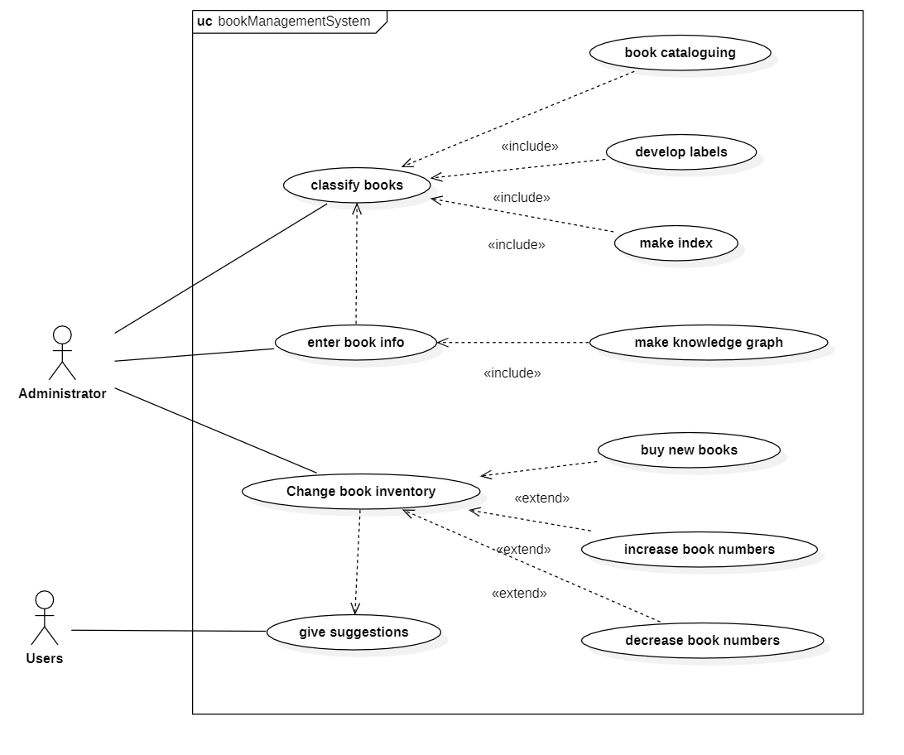
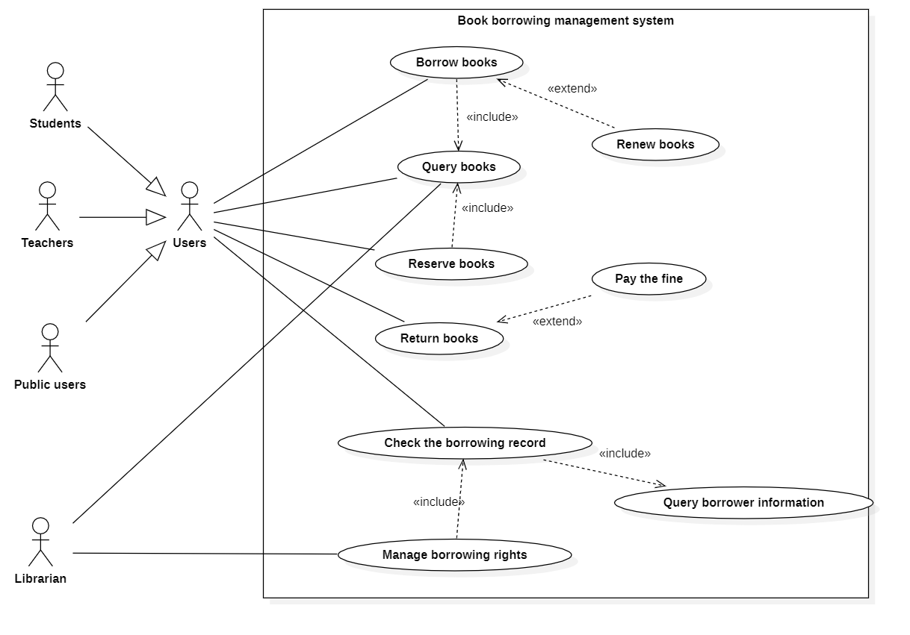
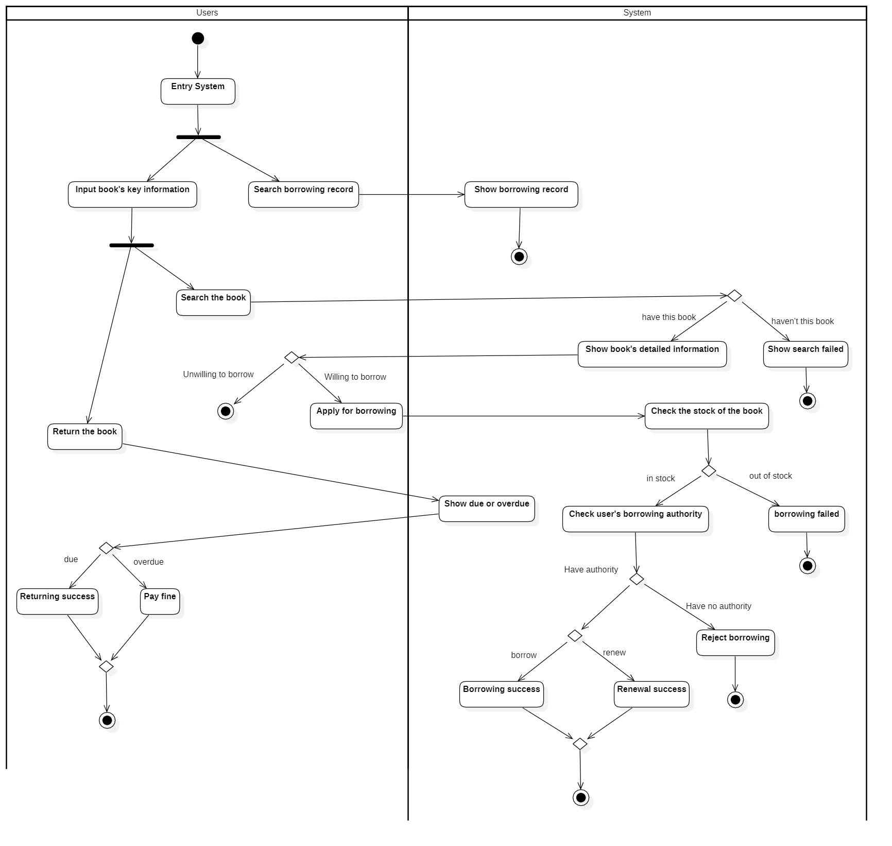

Content

[toc]

## 1.Introduction

### 1.1 Development background

The university library provides a large number of book resources for students and teachers, which is an important space for learning and exchanging ideas. Therefore, it is very necessary to establish an efficient and reliable library information management system. At the same time, human society is experiencing a new round of technological and industrial revolutions led by artificial intelligence, big data, and other technologies. At present, these emerging technologies are not fully applied in the field of library management. Based on the concept of Smart +, we believe that the library management system should provide more convenient and efficient information and knowledge services for schools and society by transforming it into intelligent systems. Through software engineering and big data technologies, we plan to develop an intelligent university library management system.

### 1.2 Functions of the System

- The system can realize the management of book resources and support the classification, cataloguing, labelling, indexing, input, modification, deletion, and other functions of the collection of books.
- The system can manage the borrowing information and support readers' borrowing, returning, renewing, and other businesses.
- The system supports the management of reader information and the operation of user account registration, login, and password modification. In addition, readers can be divided into teachers, students, and the public for separate management, providing different permissions for different types of readers.
- The system supports a variety of terminals, enabling users to handle services online through various terminals.
- The system supports the management of venue resources and users' reservations of venues.
- The system supports the reader communication function, which can analyze readers' reading preferences according to their borrowing records, and help readers find other readers with the same interests to communicate according to their reading preferences.

### 1.3 Target users

- Students: Students of the university can inquire, borrow and renew books on the system, and deal with violations. They can make reservations for seats. They can log on to the forum to express views and communicate with people who have similar reading interests.
- Teachers: similar to the authority of students in the university. But the authority to query and borrow books and periodicals is higher.
- Public users: Public users can search books on the system. They can read books and periodicals in the reading room but can not take books and periodicals out of the library. Can reserve the library reading room seats.
- Librarian: Manage all the library books borrowing and returning through this system. Check out the information and borrowing status of the books. Manage the borrowing rights of various users.
- Administrator: Review forum posts in the system and deal with illegal users.

### 1.4 Originalities of the System

1. Forum functions and readership. In the future, the system will improve the forum function, and establish their own readership circle for different reader groups. In the forum, users can have academic exchanges but also can put forward corresponding suggestions and opinions for the improvement of the library management system. In the reader circle, readers with the same reading hobby can make friends and exchange their reading insights.
2. The application of big data. Big data technology is used to collect users' daily bibliographic journal query, action location track, reading period, and other information, so as to understand the knowledge needs and reading habits of each user. In order, according to these analysis results, the system can timely complete and update the books and periodicals that are the most concerned by user groups and that has been the most frequently retrieved and borrowed, and push the latest knowledge information in each professional field required by users according to the personalized needs of users.

## 2. Glossary of Terms

| Terms                                 | Definition                                                                                                                                                                                                                                                                                                            |
| ------------------------------------- | --------------------------------------------------------------------------------------------------------------------------------------------------------------------------------------------------------------------------------------------------------------------------------------------------------------------- |
| **User**                        | All the people who could use the Smart University Library Management System.                                                                                                                                                                                                                                          |
| **Teacher**                     | The person teaching classes at the university.                                                                                                                                                                                                                                                                        |
| **Student**                     | The person enrolled in classes at the university.                                                                                                                                                                                                                                                                     |
| **Public user**                 | The system users are other than the students and teachers. Could be someone from the community near the University and so on. The system is open to society.                                                                                                                                                          |
| **Account**                     | A representation of a user's identity in a system in which a user can access certain contents of the system only after logging in to his or her account.                                                                                                                                                              |
| **Administrator**               | A person who has permission to create and delete accounts or change the book information in the system. Administrators execute the decrease or increase of books in this system.                                                                                                                                      |
| **Suggestion**                  | A piece of advice that is carried out by the users, will bring a more convenient experience to users if the advice is adopted.                                                                                                                                                                                        |
| **Book Diagram**                | A diagram that stores all the information of all the books in the library, including the name, index, category, entry time, and the borrowing authority of different users of each book.                                                                                                                              |
| **Forum**                       | An online discussion platform where users can post messages and reply to other users’ messages.                                                                                                                                                                                                                      |
| **Post**                        | A message that a user submits to the forum. A post can include text, images, videos, or other types of content.                                                                                                                                                                                                       |
| **Bookmark**                    | A mark of a post so that the post can be easily accessed later.                                                                                                                                                                                                                                                                  |
| **Open Space**                  | Space in the library building could be accessed by anyone with a SULMS(Smart University Library Management System) account. The open spaces have facilities including public PCs, tables and desks, bookshelves, study rooms, etc.                                                                                    |
| **Study Room**                  | A room that could be used exclusively by one or a few users for studying purposes. Only teachers and students can use a study room. One must book a spare room before using it. If the user fails to arrive on time, he or she will be punished.                                                                      |
| **Password** | A series of letters or numbers that you must type into the library management system in order to be able to use it.                                 |
| **Borrowing  Record** | A borrowing record takes down information about book borrowing activities. For users, borrowing record has information like how many books he has borrowed, the title of the book, and the time and duration. For a book, the borrowing record has information about when the book is borrowed and returned. |
| **Borrowing Right** | A user is allowed to borrow this book if he has the borrowing right over this specific book.                                                                                                                                                               |
| **Authorization** | The official permission that was controlled by the Administrator for the users to use a study room etc.                                                                                                 |

## 3. Use case modeling

### 3.1 Book Management System

**Use Case Diagram**

**Concise Text Descriptions**

**Give suggestions:** After using the Smart Library System, the users may have some suggestions that will bring a more convenient experience to users if the advice is adopted.

**Change book inventory:** Include buy new books, increase book numbers and decrease book numbers.

**Buy new books:** By adopting users' suggestions, the administrators may find that the library misses some good books, thus buying them and updating the information.

**Increase book numbers:** Add more books to the library and update the information.

**Decrease book numbers:** Remove some books out and update the informaation.

**Enter book info:** After change the book inventory, the manager should update the book information.

**Make knowledge graph:** By using big data technology, the Smart Library System automatically generate a knowledge graph which indicates the information of the inventory of the library.

**Classify books:** Include book cataloguing, developing labels and making index.

**Book cataloguing:** Give each book a category so that users can find it easily.

**Make index:** An index is a string of numbers that will make librarians place books to the right place more efficiently.

**Detailed Specification for Use Case**

Use Case : Administrator’s Operation

| **USE CASE**          | **Administrator’s Operation**                                |
| --------------------- | ------------------------------------------------------------ |
| **ID**                | UC01                                                         |
| **Specification**     | This use case allows the administrator to check users’ suggestions or look for the statistic laws to determine whether to buy new books or increase some books or decrease some special book inventory. |
| **Actors**            | Administrators                                               |
| **Pre-Condition**     | The administrator already login.                             |
| **Basic Flow**        | When the administrator login successfully, the use case begins. 1. The administrator first checks the message to find out whether to change some books’ inventory or not. 2. Then, after receiving information from users and statistic laws, the administrator knows whether to decrease or increase or buy new books. 3. After that, the administrator changes the book inventory information and changes the storage. 4. Then, give the increased books or new books labels, index and catalog them and place them in right place. 5. The administrator ends his work, and the use case ends. |
| **Alternative Flows** | a. After checking messages, the administrator may find that there’s nothing to do, and then the use case should end immediately. |
| **Post-Condition**    | After successfully operating, the library’s book inventory has changed, the users may find more books and have a more convenient experience and the administrator should wait for the next change. |

Use Case : User Give Suggestions

| **USE CASE**          | **Give Suggestions**                                         |
| --------------------- | ------------------------------------------------------------ |
| **ID**                | UC02                                                         |
| **Specification**     | This use case allows users to give some suggestions depending on their experience. |
| **Actors**            | Public users                                                 |
| **Pre-Condition**     | Public users should use the library and book management system beforehand and have some experience to put forth. |
| **Basic Flow**        | The use case begins when the public user login successfully. 1. After the users submit their suggestions, this use case ends. |
| **Alternative Flows** | a. The users may find that there is no need to give such a suggestion for the reason that the suggestion is hard to implement or the suggestion is only depend on his own experience and there is no commonality in others. |
| **Post-Condition**    | After giving suggestions, the administrator should login to handle the suggestions |

### 3.2 Account Management System

**Use Case Diagram**

**Concise Text Descriptions**

**Login account:** This use case allows the user to log in to the account by entering the correct username, password, and verification code.

**Exit account:** This use case allows the user to log out of the account from the system, after which the user needs to log in again in order to access the system.

**Change password:** This use case allows the user to change the login password of his/her account. After the change, the user must use the changed login password to log in to the account again.

**Modifying user information:** This use case allows the user to modify some of the personal information saved in the system, such as the mobile phone number and bound email address.

**Retrieve password:** This use case allows users to retrieve their login password if they forget their login password by entering the account name and then using email authentication.

**Email authentication:** This use case is used to verify the user's email when retrieving the password. The system sends a verification email to the email box bound to the user. The user can complete the verification by clicking the verification link in the email, and the password can be retrieved after the verification is completed.

**Register account:** This use case allows public users to register new accounts on their own, after registration of public users can login the account access to the system.

**Bind email address:** This use case is used for mailbox authentication when a user binds an email. The system sends a verification email to the email box that the user wants to bind. The user can complete the verification by clicking the verification link in the email. After the verification is completed, the binding can be completed.

**Cancel account:** This use case allows public users to cancel their account, which will be permanently deleted and then unable to log in to the account.

**Create account:** This use case allows the account administrator to create an account for the newly enrolled teachers and students. The account user name is the user's student ID or job ID, the password is the default value, and the personal information is the personal information saved in the student information management system or the faculty information management system.

**Delete account:** This use case allows the account administrator to delete the account for students and faculty who have left the university. After deleting the account, the account will not be used to log in to the system.

**Detailed Specification for Use Case**

Use Case: Login Account

| **USE CASE**          | **Login Account**                                            |
| --------------------- | ------------------------------------------------------------ |
| **ID**                | UC03                                                         |
| **Specification**     | This use case allows the user to log  in to the account by entering the correct username, password, and verification code. |
| **Actors**            | **Users**                                                    |
| **Pre-Condition**     | The user already has his own account in the system.          |
| **Basic Flow**        | When the user enters the login page, the use case begins. 1. The user enters the username, password, and verification code in the input box, and then clicks  "Login".  2. The system confirms that the verification code entered by the user is correct. 3. The system determines that the username and password entered by the user match. 4. The user logs in to the account successfully, and the use case ends. |
| **Alternative Flows** | a. At any point in the login process,  the user may exit the page. In this case, the login fails and the use case ends. 3a. If the system confirms that the verification code entered by the user is incorrect, a message "Verification Code error" is displayed. The login fails and the use case ends. 4a. If the system confirms that the  password entered by the user is incorrect, the system displays a message indicating "Incorrect username or Password". The login fails and the use case ends. |
| **Post-Condition**    | After successful login,  users can log out of the account, change the login password, or modify their information. |

Use Case: Register Account

| **USE CASE**          | **Register Account**                                         |
| --------------------- | ------------------------------------------------------------ |
| **ID**                | UC04                                                         |
| **Specification**     | This use case allows public users to  register new accounts on their own. |
| **Actors**            | **Public  users**                                            |
| **Pre-Condition**     | Public users access the system for the  first time and do not have their own accounts. |
| **Basic Flow**        | The use case begins when  the public user goes to the login page and clicks "Register". 1. The public user enters  the username wants to register in the input box and clicks "Next".  2. The system confirms that  the entered user name has not been used.  3. The public user enters  the password and the confirm password in the input box, and clicks “Next”.   4. The system confirms that  the password entered by the user is the same as the confirmed password; 5. The public user enters  the email address wants to bind and clicks "Verify". 6. The system sends a  verification email to the email address entered by the user, and the public user clicks the verification link in the verification email to pass the verification within 48 hours. 7. The account is successfully registered, and the use case ends. |
| **Alternative Flows** | a. If the public user exits the page  at any of the first 5 steps, registration fails and the use case ends. 2a. If the system confirms that the  username entered by the public user has been used, the system displays a  prompt "The username has been used" and returns to step 1.  4a. If the system finds that the  password entered by the public user is different from the confirmed password,  the system displays the message "Confirm password is different from the  password" and returns to step 3.  6a. If the public user does not receive the verification email, they can modify the email address and click  " Reverify " or directly click " Reverify". Then the  system will resend the verification email, and the previous verification  email will become invalid. 6b. If the public user does not complete the authentication within 48 hours of the validity period of the verification email, the account registration fails and the use case ends. |
| **Post-Condition**    | After successfully  registering an account, the public user can log in to the system through the  account. |

### 3.3 Book Borrowing Management System

**Use Case Diagram**

**Concise Text Descriptions**

**Borrow books:** Users with authority to borrow books stocked in the library.

**Return books:** Users return the books they have borrowed from the library.

**Search books:** The user enters the information of the book he wants to query, and the system displays the corresponding book.

**Renew books:** The user continues to borrow the books they are borrowing.

**Pay the fine:** Users pay fines for exceeding the borrowing period.

**Check the borrowing record:** The user or the librarian queries the user's borrowing records. The borrowing record includes the books that users have already borrowed and the books that they are borrowing, as well as the borrowing time of each book. Based on this,the librarian can determine whether the user exceeds the borrowing period.

**Manage the borrowing right:** The librarian can manage the user's borrowing rights. Students, teachers, and public users have different permissions. In addition, the librarian can cancel the permission of the users who fail to return the books many times according to the regulations

**Query borrower information:** View the user's personal information. Including the user's permission, borrowing records, and so on

**Detailed Specification for Use Case**

Use Case: Borrow Books

| **USE CASE**          | **Borrow Books**                                                                                                                                                                                                                                                                                                                                                                                                                                                                                                                                                                                                                                                                                                                                                                                                                                                             |
| --------------------------- | ---------------------------------------------------------------------------------------------------------------------------------------------------------------------------------------------------------------------------------------------------------------------------------------------------------------------------------------------------------------------------------------------------------------------------------------------------------------------------------------------------------------------------------------------------------------------------------------------------------------------------------------------------------------------------------------------------------------------------------------------------------------------------------------------------------------------------------------------------------------------------------- |
| **ID**                | UC05                                                                                                                                                                                                                                                                                                                                                                                                                                                                                                                                                                                                                                                                                                                                                                                                                                                                               |
| **Specification**     | The user queries the books they want to borrow and applies for borrowing.                                                                                                                                                                                                                                                                                                                                                                                                                                                                                                                                                                                                                                                                                                                                                                                                          |
| **Actors**            | **User**                                                                                                                                                                                                                                                                                                                                                                                                                                                                                                                                                                                                                                                                                                                                                                                                                                                                     |
| **Pre-Condition**     | The user enters key information about the book to borrow in the system.                                                                                                                                                                                                                                                                                                                                                                                                                                                                                                                                                                                                                                                                                                                                                                                                            |
| **Basic Flow**        | 1. User enters the key information about the book.  2. User clicks the 'query' button to query books. 3. System retrieves the existence of books corresponding to the information entered by the user. If successful, display the details of the book.  4. User applies for a library.  5. System views the book inventory. If sufficient, turn to 6.  6. Check the user's borrowing authority. If available, then borrow successfully.                                                                                                          |
| **Alternative Flows** | a. If the information entered is incorrect format, the system will prompt the user to re-enter the information of the book. b. If the query book does not exist or the book is not included in the library, the system will indicate that the book does not exist or the library does not include the book, and prompt to query. c. If the inventory of the book is insufficient, the system will indicate that the inventory of books is insufficient, and recommend similar books. d. If the user does not have borrowing authority, the system will prompt the user not to have the right to borrow and refuses to borrow the book. |
| **Post-Condition**    | Users borrow books successfully.                                                                                                                                                                                                                                                                                                                                                                                                                                                                                                                                                                                                                                                                                                                                                                                                                                                   |

Use Case: Return Books

| **USE CASE**          | **Return Books**                                                                                                                                                                                                                                                                                                                   |
| --------------------------- | ------------------------------------------------------------------------------------------------------------------------------------------------------------------------------------------------------------------------------------------------------------------------------------------------------------------------------ |
| **ID**                | UC06                                                                                                                                                                                                                                                                                                                           |
| **Specification**     | The user enters the information about the book he wants to return, and the system shows the borrowing situation of the book.                                                                                                                                                                                                   |
| **Actors**            | **User**                                                                                                                                                                                                                                                                                                                 |
| **Pre-Condition**     | The user has borrowed the book before.                                                                                                                                                                                                                                                                                         |
| **Basic Flow**        | 1. The user enters the information about the book you want to return.  2. User clicks the ‘return’ button to return the book. 3. Query and show whether the book has exceeded the deadline. If the time limit is not exceeded, the book is returned successfully. |
| **Alternative Flows** | 3.1 If the user exceeded the time limit, the system will prompt the user to pay the fee before returning the book. If the fine has been paid, returning success.                                                                                                                                                               |
| **Post-Condition**    | Users return books successfully.                                                                                                                                                                                                                                                                                               |

### 3.4 Venue Management System

**Use Case Diagram**

**Concise Text Descriptions**

**Enter Open Spaces:** This use case happens when a user wanted to enter the library building in order to borrow and return books, use the facilities like tables and study rooms. There is no limitation unless the total number of people inside reaches the threshold.

**Book a Study Room:** In this use case, teachers and students will see information about the study rooms on the system interface. Users could book a study room by choosing a spare room, a time spot to enter the room and the duration. Users could only use the study room after booking one.

**Check Authorization:** The study rooms are designed to meet the needs of students and teachers in the university. So public users from outside of the university do not have the right to book a study room. Thus, this process must be done first when a user is trying to book a room, to make sure that this user is allowed to do so.

**Choose a Time:** Users must choose a vacant room and spare time when booking the study room. 

**Check in to a Study Room:** Users must check in to a study room at the registered time. The user could either wipe the library card or enter the temporary password he or she get after booking. The room door will be unlocked after the check-in process.

**Issue Punishment:** This process will be carried out when a user does not arrive on the booked time. He will be punished and could not use the study room for a certain time. This could make sure that the library's study resources are fully used.

**Alter Authorization:** Administrator can change a user's authorization to book a study room. This may happen when a public user becomes a teacher or a student of the university, or a teacher quit the job.

**Detailed Specification for Use Case**

Use Case:Enter Open Spaces

| **USE CASE**          | Enter Open Spaces                                                                                                                                                                                                                                  |
| --------------------------- | -------------------------------------------------------------------------------------------------------------------------------------------------------------------------------------------------------------------------------------------------- |
| **ID**                | UC07                                                                                                                                                                                                                                                 |
| **Specification**     | This use case happens when a user wanted to enter the library building in order to borrow and return books, use the facilities like tables and study rooms. There is no limitation unless the total number of people inside reaches the threshold. |
| **Actors**            | Users                                                                                                                                                                                                                                              |
| **Pre-Condition**     | User's account must be valid and active                                                                                                                                                                                                            |
| **Basic Flow**        | 1. The user reaches the turnstile at the front gate of the library building. 2. User verifies his or her identity at the smart device attached to the turnstile.  2.1 If the user has a library card, he or she could swipe the card.  2.2 The user could also enter his or her account number on the panel to get verification.``3. The user walks through the turnstile and enters the open spaces. |
| **Alternative Flows** | 1. The user reaches the turnstile at the front gate of the library building. 2. User verifies his or her identity at the smart device attached to the turnstile.  2.1 If the user has a library card, he or she could swipe the card.  2.2 The user could also enter his or her account number on the panel to get verification. 3. The user walks through the turnstile and enters the open spaces. |
| **Post-Condition**    | After successfully entering the open spaces, users could see the books on the bookshelves, use public PCs to log in to the system and borrow books, use the tables and check in to a study room.                                             |

Use Case: Book a Study Room

| **USE CASE**          | Book a Study Room                                                                                                                                                                                                                                                          |
| --------------------------- | -------------------------------------------------------------------------------------------------------------------------------------------------------------------------------------------------------------------------------------------------------------------------- |
| **ID**                | UC08                                                                                                                                                                                                                                                                         |
| **Specification**     | In this use case, teachers and students will see information about the study rooms on the system interface. Users could book a study room by choosing a spare room, a time spot to enter the room and the duration. Users could only use the study room after booking one. |
| **Actors**            | **Users**                                                                                                                                                                                                                                                            |
| **Pre-Condition**     | The user must have a valid account and log in to the system and jump to the booking webpage.                                                                                                                                                                               |
| **Basic Flow**        | 1. Users click the booking button. 2. Check whether the user is authorized to use a study room(public users are not allowed to use study rooms). 3. Users browse the information of all the available time periods of study rooms. 4. Users choose a spare study room. 5. Users choose an available time period. 6. Users confirm the booking information. 7. Users get a temporary password to enter the booked study room. |
| **Alternative Flows** | a. There are no vacant rooms: users could not choose rooms and will be directed to leave this page. b. The room chosen has no vacancy: users could not choose a time(step 5) c. The user is not authorized to use the study room: The user will be informed when clicking the booking button and could not enter step 3. |
| **Post-Condition**    | Users could check in to the study room at due time.                                                                                                                                                                                                                        |

Use Case: Check in to a Study Room

| **USE CASE**          | Check in to a Study Room                                                                                                                                                                                                        |
| --------------------------- | ------------------------------------------------------------------------------------------------------------------------------------------------------------------------------------------------------------------------------- |
| **ID**                | UC09                                                                                                                                                                                                                              |
| **Specification**     | Users must check in to a study room at the registered time. The user could either wipe the library card or enter the temporary password he or she get after booking. The room door will be unlocked after the check-in process. |
| **Actors**            | Teachers and students                                                                                                                                                                                                           |
| **Pre-Condition**     | The user must have successfully booked a spare study room already. The user must have already entered the open spaces.                                                                                                          |
| **Basic Flow**        | 1. Users reach the door of the room he or she booked. 2. Users check-in:  2.1. If the user has a library card, he could swipe the card to check in.  2.2. If the user doesn’t have a card, he could enter the temporary password through the panel. 3. The system unlocks the door so that the user could get into the study room. |
| **Alternative Flows** | a. The user enters the wrong temporary password: he will be given 5 more times to enter the correct password, otherwise, he could not check in and use the room. b. The user check-in 20 minutes later than the booked time spot: The user will be punished, he could not use the study room for the next 5 days. |
| **Post-Condition**    | none                                                                                                                                                                                                                            |

### 3.5 Reader Communication System

**Use Case Diagram**

**Concise Text Descriptions**

**Search for Readers:** The user utilizes the search function within the forum to find and connect with other readers.

**View Recommended Readers:** The user views a list of recommended readers who have similar reading preferences. These recommendations are generated through big data analysis of the user’s reading habits and interests.

**View Posts:** The user views posts within the forum. The posts are displayed in an order that is determined by the user’s preferences, which are analyzed using big data techniques.

**Bookmark Favorite Posts:** The user bookmarks posts that he/she finds interesting or useful. This allows the user to easily access and view these posts at a later time.

**Share Thoughts:** The user expresses his/her opinions and thoughts to communicate with other readers in the forum.

**Reply to Posts:** The user replies to posts in the forum to express his/her opinions about the content of the post.

**Create Posts:** The user creates posts in the forum to share his/her thoughts about reading.

**Update Own Posts:** The user makes changes to posts that they have previously created. This includes updating the content of the post or deleting the post entirely.

**Report Inappropriate Posts:** The user reports a post with inappropriate content to the administrator. Inappropriate content may include offensive language, hate speech, graphic violence, or other types of content that violate the platform’s community guidelines.

**Delete Inappropriate Posts:** The administrator deletes an inappropriate post that has been reported by a user.

**Ban the Account:** The administrator chooses to ban a user’s account due to repeated violations of the platform’s terms of service, such as posting inappropriate content. The administrator may also ban the account for other reasons, as determined by the platform’s community guidelines.

**Detailed Specification for Use Case**

Use Case: View Posts

| **USE CASE**          | View Posts |
| --------------------------- | -------------------------------------------------------------------------------------------------------------------------------------------------------------------------------------------------------------------------------------------------------------------------- |
| **ID**                | UC10                                                                                                                                                                                                                                                                         |
| **Specification**     | This use case describes how a User view posts in the forum. The posts are displayed based on user preference. The User can also bookmark his/her favorite posts. |
| **Actors**            | **Users**                                                                                                                                                                                                                                                            |
| **Pre-Condition**     | None.                                                                                                                                                                               |
| **Basic Flow**        | This use case starts when the User wishes to view posts in the forum. 1. The User enters the forum page. 2. The system displays posts and topics on the page. 3. The User clicks a post. 4. The system creates a new page and displays the post content. 5. The User views the post content.|
| **Alternative Flows** | a. At any point, the User may leave the page. b. If, after step 2, the User may click a topic. If this occurs, the system displays posts from the selected topic to replace the originally displayed posts. c. If, in step 5, the User may click “Bookmark” to bookmark the post. If this occurs, the system adds the post to the User’s bookmark collection and shows a bookmarked flag. |
| **Post-Condition**    | If the User bookmarked a post, the post is added to his/her bookmark collection.  |

Use Case: Create Posts

| **USE CASE**          | Create Posts |
| --------------------------- | -------------------------------------------------------------------------------------------------------------------------------------------------------------------------------------------------------------------------------------------------------------------------- |
| **ID**                | UC11                                                                                                                                                                                                                                                                         |
| **Specification**     | This use case describes how a User creates a post to share his/her thoughts about reading in the forum. |
| **Actors**            | **Users**                                                                                                                                                                                                                                                            |
| **Pre-Condition**     | The user must be logged onto the system before this use case begins.                                           |
| **Basic Flow**        | This use case starts when the User wishes to create a post to share his/her thoughts in the forum. 1. The User enters the forum page. 2. The User clicked “Create a Post”. 3. The User selects a topic. 4. The User types the content of the post. 5. The User clicks “Post”. 6. The system adds the post to the forum and the User’s post collection. 7. The system displays a success message. |
| **Alternative Flows** | a. At any point, the User may leave the page. If this occurs in step 3 or step 4, the system displays a message about whether to save the content. If the User chose to save, the content is saved as an unposted post in the User’s post collection. |
| **Post-Condition**    | If the use case was successful, a new post is submitted to the forum and added to the User’s post collection.  |

Use Case: Reply to Posts

| **USE CASE**          | Reply to Posts |
| --------------------------- | -------------------------------------------------------------------------------------------------------------------------------------------------------------------------------------------------------------------------------------------------------------------------- |
| **ID**                | UC12                                                                                                                                                                                                                                                                         |
| **Specification**     | This use case describes how a User replies to a post to express his/her opinions about the post in the forum. |
| **Actors**            | **Users**                                                                                                                                                                                                                                                            |
| **Pre-Condition**     | The user must be logged onto the system before this use case begins.                                           |
| **Basic Flow**        | This use case starts when the User wishes to reply to a post in the forum. 1. include (View Posts). 2. The User clicks the reply box. 3. The User types the reply. 4. The User clicks “Reply”. 5. The system attaches the reply to the post and displays the reply on the page.|
| **Alternative Flows** | a. At any point, the User may leave the page. b. If, in step 4 where the post was already deleted, the system displays an error message and the use case terminates. |
| **Post-Condition**    | If the use case was successful, a new reply is posted below the post.  |

## 4.Supplementary Specification

### 4.1 Objectives

The purpose of this document is to define requirements of the Smart Library System. This Supplementary Specification lists the requirements that are not readily captured in the use cases of the use-case model. The Supplementary Specifications and the use-case model together capture a complete set of requirements on the system.

### 4.2 Scope

This Supplementary Specification applies to the Smart Library System This specification defines the non-functional requirements of the system; such as reliability, usability, performance, and supportability, as well as functional requirements that are common across a number of use cases. (The functional requirements are defined in the Use Case Specifications.)

### 4.2 Performance

- Due to the total number of users and administrators may exceed 5,000, the system shall support up to 2000 simultaneous users against the central database at any given time, and up to 500 simultaneous users against the local servers at any time.
- The system must respond to each request within one second.
- The system must be able to process at least 300 requests concurrently, and it must be able to complete 90% of all requests within 2 minutes.

### 4.3 Reliability

Not considering network failing, the system shall be available 24 hours a day 7 days a week, with no more than 1% down time. Specially, the system must be 100% operational in 99.9% of the calendar year during some special time in a year(like winter and summer vocation or postgraduate examinations period).

### 4.4 Security

- The security of the system includes authentication, access control, data integrity and data privacy.
- The system has a centralized database and will not allow inventory data or other important data to be stored outside of its servers. Also, this system assumes that only the user or whoever he/she allows will have access to his/her user interface.
- Users must be authenticated with a user name and password.
- A user who wants to change his/her user password must verify himself/herself by inputting a right verification code.
- A user who forget his/her name and want to recover it must apply to the administrator.
- Sensitive information should be stored in the database with strong encryption algorithm, and transmission information should be encrypted to protect privacy.
- Only the administrator has the permission to change the information of the inventory, the public users only have access to view the information.

### 4.5 Supportability

- In case of system error, operation and maintenance personnel can diagnose and solve the problem within 2 hours.
- The system should be easy to expand, and the code should be conducive to the realization of new functions.
- This system should update as well as back up data regularly.
- The most likely places to go wrong are high concurrency time such as vocation or when a academic forum is held, one of the solution is to hence it's data processing capabilities by using more appropriate data base.

### 4.6 Comprehensibility

The text and buttons in the GUI should be friendly for teachers and students.

The system shall provide Web pages that can run on multiple platforms.

### 4.7 Design constraints

- We should use java to implement it's logical section.
- Use html to display the pages
- Use MySql to store data and implement data-related operations

## 5. References

[1] Martin Fowler. UML Distilled: A Brief Guide to the Standard Object Modeling Language (3rd Edition)[M]. Boston: Addison-Wesley Professional.

This book not only introduces the key aspects of UML, but also clearly demonstrates the role UML plays in the development process. By reading this book we can learn how to draw UML.

[2] Yanfang Xie. The Design and Implementation of University Library Management System[D]. Shanghai Jiaotong University,2011.

This article analyzes the present situation and the deficiency of library management systems at home and abroad, as well as the development trend of library management systems under the condition of the continuous information development of library business work. It also introduces the university library management system designed and developed by itself, including the development technology used in the system, the system demand analysis, the system design and implementation, and the system test and analysis.

[3]  Li Lin. Design of Digital Library Management System[J]. New Technology and New Products of China, 2021, No.438(08):30-32.DOI:10.13612/j.cnki.cntp.2021.08.010.

This article analyzes the current situation and limitations of the digital library management system, and designs a digital library management system combining the relevant technologies of big data and cloud storage, which has functions such as intelligent query, literature association, data statistics, big data user analysis, literature synchronous upload and cloud progress.

## 6.Contributions

## 7. Agile Methods
