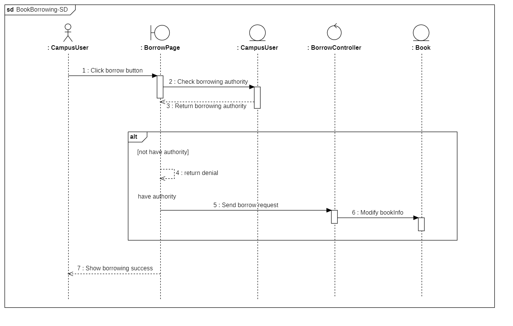
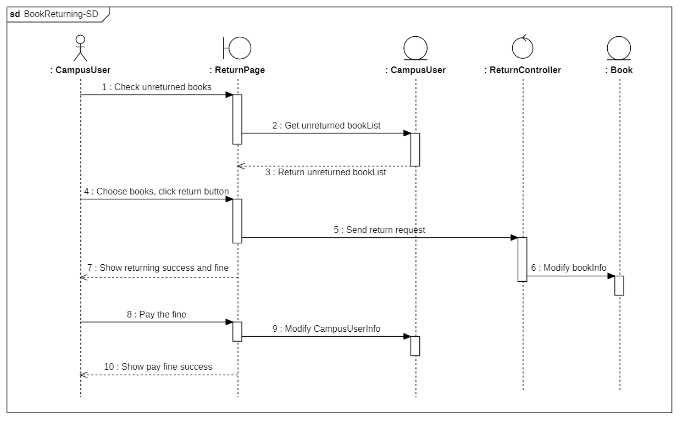
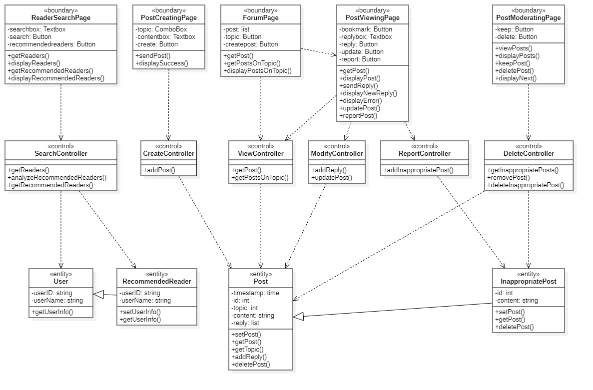
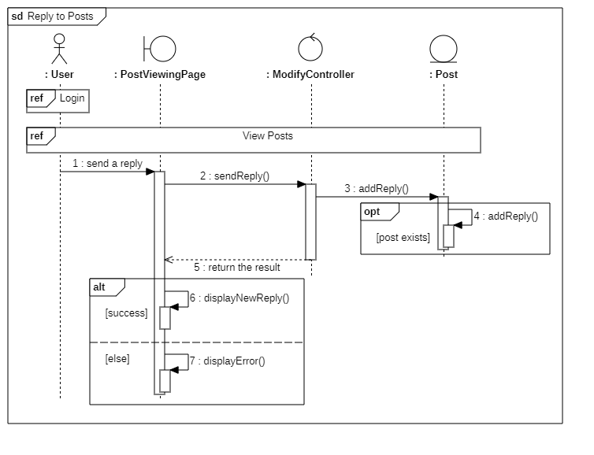
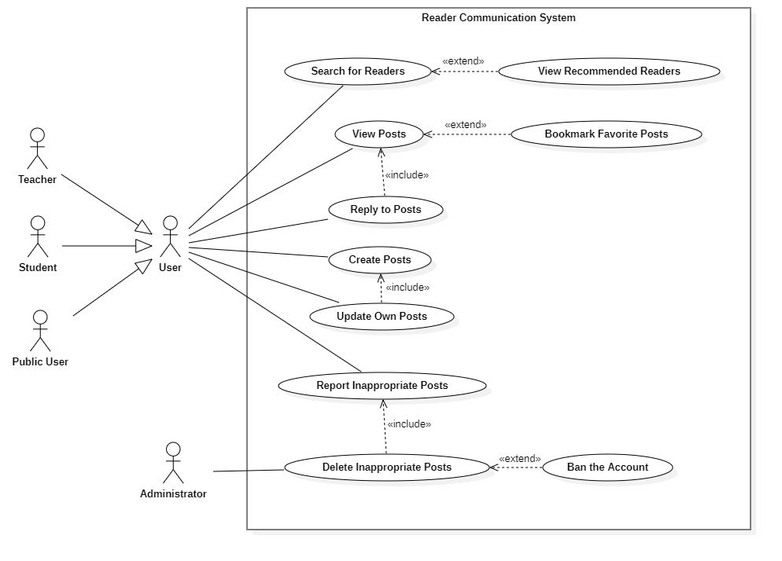

[TOC]

## 1. Introduction

### 1.1 Project Goals

The university library provides a large number of book resources for students and teachers, which is an important space for learning and exchanging ideas. Therefore, it is necessary to establish an efficient and reliable library management system.

Meanwhile, human society is experiencing a new round of technological and industrial revolutions led by artificial intelligence, big data, and other technologies. However, these emerging technologies are not fully applied in the field of library management. Based on the concept of Smart+, we believe that a library management system should provide more convenient and efficient services for schools and society.

Through software engineering and big data technologies, we plan to develop a smart university library management system. The target users of our system include four kinds of people. They are:

- University students: They can inquire, borrow, and renew books on the system, and deal with violations. They can also make reservations for seats and log on to the forum to communicate with people who have similar reading interests.

- Teachers: They have similar functions as students, but they have a higher authority to query and borrow books and periodicals.

- Public users: They can search for books on the system and read books and periodicals in the reading room, but they cannot take them out of the library. They can also reserve the reading room seats.

- Librarians: They can manage all the borrowing-returning transactions through this system, check out the information and borrowing status of the books, and manage the borrowing rights of various users.

This is how we envision our system to work and benefit different user groups.

### 1.2 Progress and Current Status

In the previous assignment, we divided the smart library system into five subsystems: Book Management System, Account Management System, Book Borrowing Management System, Venue Management System, and Reader Communication System. We also presented their use case models and analyses in detail.

For this assignment, we first provide the architecture diagram of the entire system and explain its components and rationale. The architecture diagram shows how the subsystems interact with each other and with external entities such as users, databases, and hardware devices. It also shows the layers of abstraction that separate the presentation, business logic, and data access of the system. We also describe the design principles and patterns that we used to create a modular, scalable, and reliable system.

In this assignment, we also design the components at each level based on this architecture. We use class diagrams to show the classes and their attributes, methods, and associations for each subsystem. We also use interaction diagrams to show how the classes collaborate to realize the use cases of each subsystem. We use sequence diagrams to show the temporal order of messages exchanged between objects, and we use communication diagrams to show the structural organization of objects and their links.

During the analysis, we also identify and improve the poorly designed elements in the use case models of the previous assignment. For example, we eliminate redundant or unnecessary use cases. We also modify inconsistent or incorrect use cases.

Therefore, we have currently completed the architectural analysis of the entire system and the class and interaction analysis of each subsystem.

## 2. Architectural Analysis

架构分析：以高级架构、子系统的形式介绍项目，并详细说明在当前阶段之前所做的体系结构决策。您应该至少包括一个系统级图表，例如，系统的分层体系结构。您还应该为系统级关系图提供文本描述。

### 2.1 System-Level Architecture Analysis and Designs

JIYU system is a based on the web platform focusing on club management and
communication between diffrent people. In order to promote the club communication
platform by taking advantage of the system and seize the opportunity, on the one hand,
from the user perspective we should pay attention to the rich and complete functions and
the security and confidentiality of personal information in the system. On the other hand,
we should extract the same functions and mechanisms in the business to improve the
platform performance and availability from the perspective of developers.

#### 2.1.1 System Detailed Analysis

In the requirement phase, we focus on the interaction between different objects outside
the system and all the system. We also complete the preliminary analysis of the system in
the form of use cases. In the early stage of architecture design, we consider the specific
behavior steps of the system to realize the use case, further divide the system into smaller
granularity systems according to the function, and complete the transformation of the
use case in the form of robust graph.

#### 2.1.2 Hierarchical Architecture Design

According to the reference, the traditional three-layers architecture design has presentation, business logic and data access layer.

We enhance and strengthen the architecture analysis and design of the system by dividing the traditional three-layer logic system architecture in to fine-grained sub-layers. The system-level architecture can be denoted by the blocks of sub-layers as follow:

By means of a package diagram and components, we seamlessly incorporate the aforementioned architecture design into the smart library management system, enhancing its overall functionality. The integration process capitalizes on the system's existing capabilities and harmoniously merges them with the proposed architecture design. This strategic amalgamation creates a cohesive and robust framework that optimizes the system's performance and efficiency. Through the careful alignment of the package diagram and components, we ensure a seamless integration that preserves the intended purpose and objectives of the smart library management system.

The high level architecture diagram is as follow:

##### 2.1.2.1 User Interface Layer

##### 2.1.2.2 Control Layer

##### 2.1.2.3 Business Layer

##### 2.1.2.4 Universal Service Layer

##### 2.1.2.5 Data Process Layer

## 3. Analysis Model

### 3.1 Book Management System

#### 3.1.1 Class Diagram

#### 3.1.2 Sequence Diagrams

##### 3.1.2.1. User Give Suggestions

This sequence diagram shows what happens after a user submits a suggestion. The page sends the suggestion as a request to the backend, which receives it, returns a success message, and gives feedback in the user interface.

##### 3.1.2.2. Librarian Get Suggestions

The process of administrator viewing suggestions is similar to the process of user sending suggestions, except that the request sent by the interface changes from a suggestion to a get request, and the data returned by the backend changes from success information to the content of the suggestion

##### 3.1.2.3. Manage Inventory

This sequence diagram shows the process by which a librarian receives a suggestion and then changes the book inventory based on the suggestion. The librarian first selects one from adding books and reducing books (adding books includes adding existing books and acquiring new books). If adding books is selected, the books are added and the newly added books are classified, tagged, indexed, etc., and then the information of the book inventory is updated; if reducing books is selected, the books are directly reduced and the book information is updated.

##### 3.1.2.4. Librarian Change Knowledge Graph

This sequence diagram shows the various operations of the librarian on the knowledge graph. The librarian can delete, add, or update the knowledge graph, and all three processes are similar: the interface first sends a request to the backend, which receives the request and processes it logically, then returns the result to the interface and displays it.

##### 3.1.2.5. User Use Knowledge Graph

The process of using knowledge graphs by users is similar to that of librarians. Users can choose to view the current knowledge graph, use the knowledge graph to compare different books, analyze users' reading preferences based on their reading records and get recommended books, and other operations. All these operations are the process that the page initiates the request, the back-end processes it and returns the result and displays it.

### 3.2 Account Management System

#### 3.2.1 Class Diagram

#### 3.2.2 Interaction Diagrams

##### 3.2.2.1 Users Login

This sequence diagram shows how users login to the system.

##### 3.2.2.2 Public Users Register

This sequence diagram shows how a public user registers an account in the system.

##### 3.2.2.3 Users Modify Information

This sequence diagram shows how a user modify his information in the system.

##### 3.2.2.4 Users Retrieve Password

This communication diagram shows how a user retrieve his password in the system.

##### 3.2.2.5 Account Administrator Manage Account

This communication diagram shows how an account administrator manages accounts in the system, including creating and deleting accounts.

### 3.3 Book Borrowing Management System

#### 3.3.1 Class Diagram

#### 3.3.2 Interaction Diagrams

##### 3.3.2.1 Borrow Books

This sequence diagram show how the borrowers borrow books.

##### 3.3.2.2 Return Books

This sequence diagram shows how the borrowers return the books.

##### 3.3.2.3 Modify Authority

This sequence diagram shows how the librarian modify the borrower's authority.

### 3.4 Venue Management System

#### 3.4.1 Class Diagram

#### 3.4.2 Interaction Diagrams

##### 3.4.2.1 Enter Open Space

This sequence diagram shows how a user can enter open spaces of a University library. It demonstrates the data flow between the system and the user. They were connected by the interface Entry Panel. A controller is designed to arrange the data flow.

##### 3.4.2.2 Book a Study Room

This sequence diagram shows how some of the users(teachers and students) can book a study room in the library. It demonstrates the data flow between the system and the user. They were connected by the interface of a booking webpage. A room booking controller is designed to arrange the data flow.

##### 3.4.2.3 Check in to a Study Room

This sequence diagram shows how user who has already book a room can check in to it.  The diagram demonstrates the data flow between the system and the user. They were connected by the interface of a room panel. A room check in controller is designed to arrange the data flow.

### 3.5 Reader Communication System

#### 3.5.1 Class Diagram

#### 3.5.2 Interaction Diagrams

##### 3.5.2.1 Search for Readers

This communication diagram shows how the objects in the system interact when a user sends a search for readers.

##### 3.5.2.2 View Posts

This sequence diagram shows how the system processes a user’s request to view a post. The user can choose a topic first.

##### 3.5.2.3 Reply to Posts

This sequence diagram shows how the system handles a user’s reply to a post. The page displays a success or error message depending on the result.

##### 3.5.2.4 Create Posts

This communication diagram shows how the system creates a new post when a user submits one.

##### 3.5.2.5 Delete Inappropriate Posts

This sequence diagram shows how an administrator deletes inappropriate posts. The administrator views the reported posts first, and decides whether to keep the post or delete it. The loop fragment shows that the administrator repeats the decision making process until there is no more post to moderate.

## 4. Updated Use Case Model

### 4.1 Updated System: Book Management System

In the last assignment, in terms of the knowledge graph, we only considered the librarian's modifications to it. For this assignment , we found that users also have the need to use the knowledge graph, so we added the function to use the knowledge graph to the use case model.

The updated use case diagram is as follows.

### 4.3 Updated System: Book Borrowing Management System

In the past use case diagram, the borrower has a use case called "reservebooks", which is a function that is not practical, and we have deleted it in this assignment. In the past use case diagram, Librarian directly contacted the use case called "Check the borrowing record", which is not reasonable, and we changed it to "Manage borrowing authority" include "Check the borrowing record" in this assignment

The updated use case diagram is as follows.

### 4.4 Updated System: Venue Management System

Based on the problems raised in the class two major changes have been made in the venue management system's use case diagram. In the past use case diagram, there is an arrow between check into a study room and enter open spaces, indicating the dependency relation. This arrow is now deleted because this dependency doesn't need to be realized in the system. It is promised physically. The authorization list is also deleted because it is not a actor of any use case, it is a detail that should be put in the detail specification.

The updated use case diagram is as follows.

### 4.5 Updated System: Reader Communication System

In the last assignment, we grouped the use cases “Reply to Posts” and “Create Posts” under the general term “Share Thoughts”. However, we realized that this was not appropriate because these two use cases are quite different from each other. Moreover, this would also increase the complexity. Therefore, we removed the use case “Share Thoughts”.

The updated use case diagram is as follows.

### 4.6 Use Case Detailed Specification

System: Venue Management System

Use Case: Enter Open Spaces

Update: In the previous report the alternative flow of this use case is miswritten. The updated version corrected it.

| **USE CASE**          | Enter Open Spaces                                            |
| --------------------- | ------------------------------------------------------------ |
| **ID**                | UC07                                                         |
| **Specification**     | This use case happens when a user wanted to enter the library building in order to borrow and return books, and use the facilities like tables and study rooms. There is no limitation unless the total number of people inside reaches the threshold. |
| **Actors**            | **User**                                                     |
| **Pre-Condition**     | User's account must be valid and active                      |
| **Basic Flow**        | 1. The user reaches the turnstile at the front gate of the library building.  2. User verifies his or her identity at the smart device attached to the turnstile.   2.1 If the user has a library card, he or she could swipe the card.  2.2 The user could also enter his or her account number on the panel to get verification.   3. The user walks through the turnstile and enters the open spaces. |
| **Alternative Flows** | a. The user is not able to go through the verification process:  a.1. If the user enters an invalid account number, he or she is allowed to renter the account number.  a.2. If the user’s card can’t be recognized, he or she should turn to a librarian for help. b. The total number of people inside the building reaches the threshold. All the users outside are not allowed to go through the turnstile |
| **Post-Condition**    | After successfully entering the open spaces, users could see the books on the bookshelves, use public PCs to log in to the system and borrow books, use the tables and check in to a study room. |

System: Venue Management System

Use Case: Check in to a Study Room

Update: The previous report doesn't contain the case when the card and the room doesn't match. It is now added to the report.

| **USE CASE**          | Check in to a Study Room                                     |
| --------------------- | ------------------------------------------------------------ |
| **ID**                | UC09                                                         |
| **Specification**     | Users must check in to a study room at the registered time. The user could either wipe the library card or enter the temporary password he or she get after booking. The room door will be unlocked after the check-in process. |
| **Actors**            | **Teacher or student**                                       |
| **Pre-Condition**     | The user must have successfully booked a spare study room already. The user must have already entered the open spaces. |
| **Basic Flow**        | 1. Users reach the door of the room he or she booked.  2. Users check-in:  2.1. If the user has a library card, he could swipe the card to check in.  2.2. If the user doesn’t have a card, he could enter password through the panel.  3. The system unlocks the door so that the user could get into the study room. |
| **Alternative Flows** | a. If the user enters the wrong temporary password: he will be given 5 more times to enter the correct password, otherwise, he could not check-in and use the room.  b. The user check-in 20 minutes later than the booked time spot: The user will be punished, he could not use the study room for the next 5 days. c. If the card does not match the room, or the room is no booked by this certain user now, the user is informed. |
| **Post-Condition**    | none                                                         |

## 5. Annotated References

### 5.1 Application Architecture Guide（<https://developer.android.google.cn/jetpack/guide?hl=zh-cn>）

This webpage provides an overview of the common application architectures for Android application development. It guides developers through a series of common architectural principles, recommended application architectures, best practices, and real-life application examples. The layered architecture and the user interface design used in this project are based on this design guideline.

### 5.2 30 minutes of learning the UML class Fig （<https://zhuanlan.zhihu.com/p/109655171>）

This web page explains in detail the basics of class diagram and the use of class diagram.It expounds the representation of specific classes, abstractions, interfaces and packages in class diagram and six relationships in class diagram, guiding the developers to correctly build class diagram in UML.We designed the class diagrams based on this article in this assignment.

### 5.3 Entity Class, Boundary Class and Control Class (<https://blog.csdn.net/u012372720/article/details/71171660>)

This article details the knowledge of entity, boundary, and control classes.The paper expounds the distinction and connection between the entity class, boundary class and control class, and tells how to abstract the entity class, boundary class and control class in the system.The article helps us to have a deeper understanding of classes by giving examples.We refer to this article when dividing the classes in this assignment.

### 5.4 Study notes of UML Sequence Diagram (<https://blog.csdn.net/fly_zxy/article/details/80911942>)

This article introduces the basics of the UML sequence diagram from various aspects.It tells the basic elements and their respective usage in the sequence diagram, the classification and corresponding usage of the combined fragments, and helps us to understand the steps of drawing the sequence diagram.We refer to this article for the design of the sequence diagram in this assignment.

## 6. Contributions of Team Members
