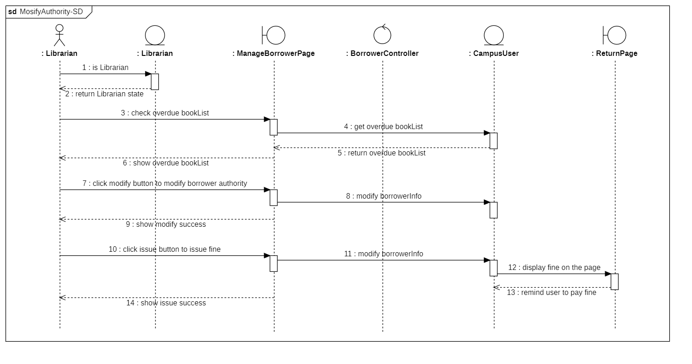

# heading

## 1. Introduction

### 1.1 Project Goals

### 1.2 Progress and Current Status

In the previous assignment, we divided the smart library system into 5 subsystems and presented their use case models and analyses in detail. In this assignment, we first provide the architecture diagram of the whole system and explain its components and rationale, and then design the components at each level based on this architecture. In this process, we also create the class and interaction diagrams for each subsystem and describe their functions and relationships. During the analysis, we also identify and improve the poorly designed elements in the use case models of the previous assignment. Currently, we have completed the architectural analysis of the whole system and the class and interaction analysis of each subsystem.

## 2. Architectural Analysis

架构分析：以高级架构、子系统的形式介绍项目，并详细说明在当前阶段之前所做的体系结构决策。您应该至少包括一个系统级图表，例如，系统的分层体系结构。您还应该为系统级关系图提供文本描述。

## 3. Analysis Model

### 3.1 Book Management System

#### 3.1.1 Class Diagram

#### 3.1.2 Sequence Diagrams

##### 3.1.2.1. User Give Suggestions

This sequence diagram shows what happens after a user submits a suggestion. The page sends the suggestion as a request to the backend, which receives it, returns a success message, and gives feedback in the user interface.

##### 3.1.2.2. Librarian Get Suggestions

The process of administrator viewing suggestions is similar to the process of user sending suggestions, except that the request sent by the interface changes from a suggestion to a get request, and the data returned by the backend changes from success information to the content of the suggestion

##### 3.1.2.3. Manage Inventory

This sequence diagram shows the process by which a librarian receives a suggestion and then changes the book inventory based on the suggestion. The librarian first selects one from adding books and reducing books (adding books includes adding existing books and acquiring new books). If adding books is selected, the books are added and the newly added books are classified, tagged, indexed, etc., and then the information of the book inventory is updated; if reducing books is selected, the books are directly reduced and the book information is updated.

##### 3.1.2.4. Librarian Change Knowledge Graph

This sequence diagram shows the various operations of the librarian on the knowledge graph. The librarian can delete, add, or update the knowledge graph, and all three processes are similar: the interface first sends a request to the backend, which receives the request and processes it logically, then returns the result to the interface and displays it.

##### 3.1.2.5. User Use Knowledge Graph

The process of using knowledge graphs by users is similar to that of librarians. Users can choose to view the current knowledge graph, use the knowledge graph to compare different books, analyze users' reading preferences based on their reading records and get recommended books, and other operations. All these operations are the process that the page initiates the request, the back-end processes it and returns the result and displays it.

### 3.2 Account Management System

#### 3.2.1 Class Diagram

#### 3.2.2 Interaction Diagrams

##### 3.2.2.1 Users Login

This sequence diagram shows how users login to the system.

##### 3.2.2.2 Public Users Register

This sequence diagram shows how a public user registers an account in the system.

##### 3.2.2.3 Users Modify Information

This sequence diagram shows how a user modify his information in the system.

##### 3.2.2.4 Users Retrieve Password

This communication diagram shows how a user retrieve his password in the system.

##### 3.2.2.5 Account Administrator Manage Account

This communication diagram shows how an account administrator manages accounts in the system, including creating and deleting accounts.

### 3.3 Book Borrowing Management System

#### 3.3.1 Class Diagram

#### 3.3.2 Interaction Diagrams

##### 3.3.2.1 Borrow Books

This sequence diagram show how the borrowers borrow books.

##### 3.3.2.2 Return Books

This sequence diagram shows how the borrowers return the books.

##### 3.3.2.3 Modify Authority

This sequence diagram shows how the librarian modify the borrower's authority.

### 3.5 Reader Communication System

#### 3.5.1 Class Diagram

#### 3.5.2 Interaction Diagrams

##### 3.5.2.1 Search for Readers

This communication diagram shows how the objects in the system interact when a user sends a search for readers.

##### 3.5.2.2 View Posts

This sequence diagram shows how the system processes a user’s request to view a post. The user can choose a topic first.

##### 3.5.2.3 Reply to Posts

This sequence diagram shows how the system handles a user’s reply to a post. The page displays a success or error message depending on the result.

##### 3.5.2.4 Create Posts

This communication diagram shows how the system creates a new post when a user submits one.

##### 3.5.2.5 Delete Inappropriate Posts

This sequence diagram shows how an administrator deletes inappropriate posts. The administrator views the reported posts first, and decides whether to keep the post or delete it. The loop fragment shows that the administrator repeats the decision making process until there is no more post to moderate.

## 4. Updated Use Case Model

### 4.1 Book Management System

In the last assignment, in terms of the knowledge graph, we only considered the librarian's modifications to it. For this assignment , we found that users also have the need to use the knowledge graph, so we added the function to use the knowledge graph to the use case model.

The updated use case diagram is as follows.

### 4.3 Book Borrowing Management System

In the past use case diagram, the borrower has a use case called "reservebooks", which is a function that is not practical, and we have deleted it in this assignment. In the past use case diagram, Librarian directly contacted the use case called "Check the borrowing record", which is not reasonable, and we changed it to "Manage borrowing authority" include "Check the borrowing record" in this assignment

The updated use case diagram is as follows.

### 4.5 Reader Communication System

In the last assignment, we grouped the use cases “Reply to Posts” and “Create Posts” under the general term “Share Thoughts”. However, we realized that this was not appropriate because these two use cases are quite different from each other. Moreover, this would also increase the complexity. Therefore, we removed the use case “Share Thoughts”.

The updated use case diagram is as follows.

## 5. Annotated References

Application Architecture Guide（<https://developer.android.google.cn/jetpack/guide?hl=zh-cn>）

This webpage provides an overview of the common application architectures for Android application development. It guides developers through a series of common architectural principles, recommended application architectures, best practices, and real-life application examples. The layered architecture and the user interface design used in this project are based on this design guideline.

## 6. Contributions of Team Members
