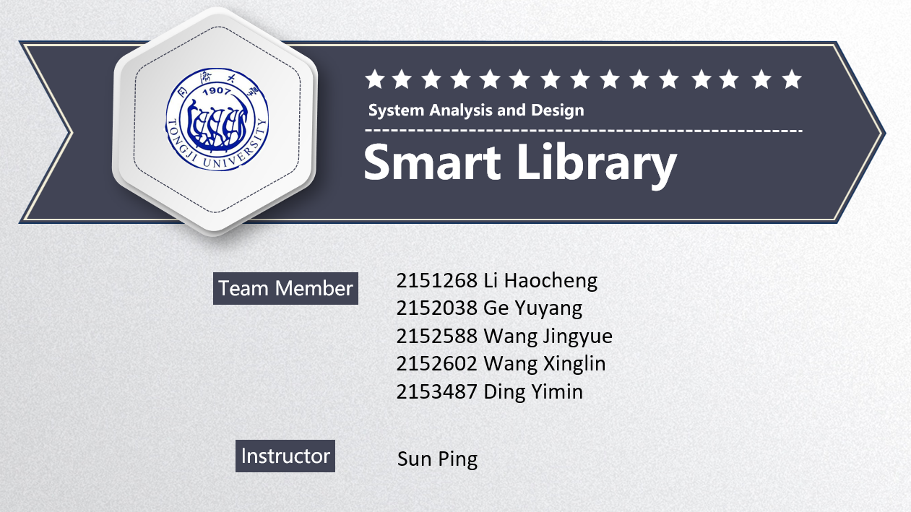

[TOC]

### 1. Introduction and overview

#### 1.1 Intention

The intention behind this document is to unveil an intricate blueprint of the Smart Library. The document will encompass the updated employment of use cases, refined architecture tailored to the platform's requirements, and realization of use cases and class design. Furthermore, it will expound upon the distinctive architectural styles and pivotal design choices that have been implemented.

#### 1.2 Advances in System Design

In the preceding assignment, we partitioned the intelligent library system into five subsystems and revealed the deployment of use cases, architecture diagrams, class diagrams, and interaction diagrams of the system.

Building upon our prior endeavor, we have accomplished the tasks of analysis and design, which encompassed the enhancement of the use case model, architectural fine-tuning, design model, as well as the identification of architectural styles and critical design choices. The principal enhancements made to our system are outlined as follows:

- **Use Case Model Enhancement:** We have refined the use case model by integrating supplementary realizations and design mechanisms. This serves to present a more comprehensive depiction of the system's functionality and user interactions.

- **Architectural Fine-Tuning:** We have crafted a platform-specific architecture with an improved overarching structure. This architecture guarantees the system's scalability, modularity, and maintainability.

- **Subsystems and Interfaces:** Each subsystem is equipped with well-defined interfaces that foster seamless communication and collaboration between disparate components.

- **Interface Specification:** We have furnished specifications for the system's interactions with external entities such as the public information website, third-party messaging system, and map services. These specifications ensure the seamless integration and exchange of data between the system and external entities.

- **Use Case Realizations:** We have incorporated five exemplars of use case realizations, thereby exhibiting the system's behavior in diverse scenarios. These realizations integrate design mechanisms and leverage the refined architecture to enhance efficiency and user experience.

- **Detailed Class Design:** We have formulated and documented over 20 comprehensive classes that encapsulate the system's data and behavior. These classes adhere to object-oriented principles and significantly contribute to the overall robustness and extensibility of the system.

In addition to the aforementioned enhancements, we have also conscientiously contemplated various architectural styles and made crucial design choices intending to optimize the system's performance and efficacy. These choices have been thoroughly evaluated and aligned with the project's requirements and constraints.

### 2. Updated use case model

#### 2.4 Updated System: Venue Management System

**Update:** 

Deleted some redundant steps in the basic flow of UC07.

| **USE CASE**          | Enter Open Spaces                                                                                                                                                                                                                                                                                                                                                                         |
| --------------------- | ----------------------------------------------------------------------------------------------------------------------------------------------------------------------------------------------------------------------------------------------------------------------------------------------------------------------------------------------------------------------------------------- |
| **ID**                | UC07                                                                                                                                                                                                                                                                                                                                                                                      |
| **Specification**     | This use case happens when a user wanted to enter the library building in order to borrow and return books, and use the facilities like tables and study rooms. There is no limitation unless the total number of people inside reaches the threshold.                                                                                                                                    |
| **Actors**            | **User**                                                                                                                                                                                                                                                                                                                                                                                  |
| **Pre-Condition**     | User's account must be valid                                                                                                                                                                                                                                                                                                                                                              |
| **Basic Flow**        | 1. User verifies his or her identity at the panel attached to the turnstile.  1.1 If the user has a library card, he or she could swipe the card.  1.2 The user could also enter his or her account number on the panel to get verification.   3. The user is allowed to enter the open space.                                                                                |
| **Alternative Flows** | a. The user is not able to go through the verification process:  a.1. If the user enters an invalid account number, he or she is allowed to renter the account number.  a.2. If the user’s card can’t be recognized, he or she should turn to a librarian for help. b. When the total number of people inside the building reaches the threshold, no more user is allowed in. |
| **Post-Condition**    | After successfully entering the open spaces, users could see the books on the bookshelves, use public PCs to log in to the system and borrow books, use the tables and check in to a study room.                                                                                                                                                                                          |

**Update:** 

Specify the actor of this use case.

| **USE CASE**          | Book a Study Room                                                                                                                                                                                                                                                                                                                                                                                                                          |
| --------------------- | ------------------------------------------------------------------------------------------------------------------------------------------------------------------------------------------------------------------------------------------------------------------------------------------------------------------------------------------------------------------------------------------------------------------------------------------ |
| **ID**                | UC08                                                                                                                                                                                                                                                                                                                                                                                                                                       |
| **Specification**     | In this use case, teachers and students will see information about the study rooms on the system interface. Users could book a study room by choosing a spare room, a time spot to enter the room and the duration. Users could only use the study room after booking one.                                                                                                                                                                 |
| **Actors**            | **Teacher/Student**                                                                                                                                                                                                                                                                                                                                                                                                                        |
| **Pre-Condition**     | The user must have a valid account and log in to the system and jump to the booking webpage.                                                                                                                                                                                                                                                                                                                                               |
| **Basic Flow**        | 1. Users click the booking button. 2. Check whether the user is authorized to use a study room(public users are not allowed to use study rooms). 3. Users browse the information of all the available periods of study rooms. 4. Users choose a spare study room. 5. Users choose an available period. 6. Users confirm the booking information. 7. Users get a temporary password to enter the booked study room. |
| **Alternative Flows** | a. There are no vacant rooms: users could not choose rooms and will be directed to leave this page. b. The room chosen has no vacancy: users could not choose a time(step 5) c. The user is not authorized to use the study room: The user will be informed when clicking the booking button and could not enter step 3.                                                                                                           |
| **Post-Condition**    | Users could check in to the study room at due time.                                                                                                                                                                                                                                                                                                                                                                                        |

### 3. Architecture Refinement

#### 3.1 Platform-dependent architecture

In the earlier design of the library management system's logical architecture, our primary concerns revolved around ensuring the internal functions of the system were robust and secure data transmission. To accomplish the enhancement and upgrade of the system's logical architecture, we made the decision to adopt a microservice architecture system rooted in domain-driven design.

The decision to transition from a layered architecture to a microservice architecture in this project was motivated by several factors:

1. Microservices promote flexibility and agility in software development. Each microservice represents a specific business capability and can be developed, deployed, and updated independently. This decoupling allows teams to work autonomously, choose their preferred technologies, and release updates without affecting the entire system. This flexibility enables faster development cycles, continuous delivery, and easier adaptation to changing business requirements.
2. In a microservice architecture, each service runs in its own process or container, which provides fault isolation. If one service fails, it doesn't bring down the entire system. Failure in one microservice can be contained without affecting others, resulting in increased overall system resilience and availability.
3. Microservices communicate with each other through well-defined APIs, enabling easy integration with external systems or third-party services. This promotes interoperability and allows the  library management system to leverage existing services or integrate with other platforms seamlessly.

Considering the aforementioned attributes of microservice architecture and a thorough evaluation of its advantages and disadvantages compared to traditional layered architecture, we have opted to craft a system architecture that embodies comprehensive internal functionality, robust security, and a lightweight nature. To accomplish this, we have made the decision to appropriately generalize and refine the previous architecture between layers, resulting in the following logical architecture diagram.

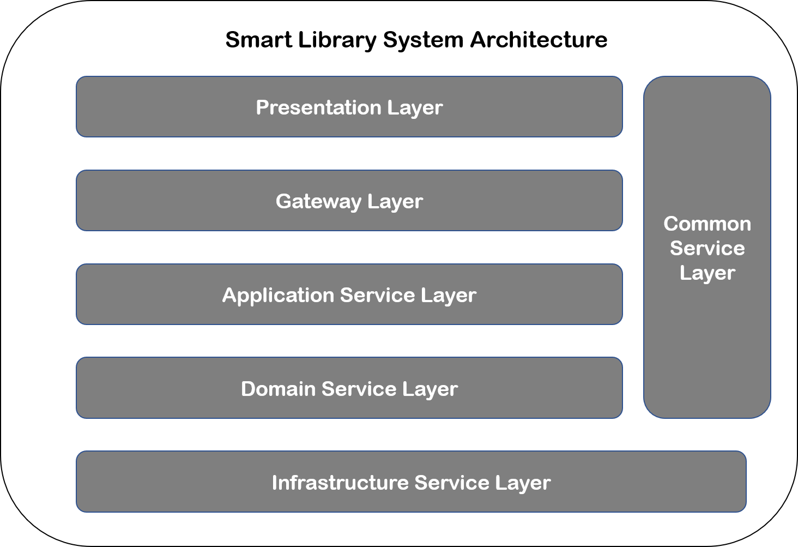

Based on the aforementioned enhanced logical architecture, we have tailored the microservices architecture to suit the project's scale. Consequently, we continue to adopt separate front-end and back-end development approaches. For the front-end, we utilize Vue.js and other libraries to facilitate development, while the back-end leverages SpringBoot and SpringCloud for general development purposes. REST-style API calls and JSON data files are employed, to enable communication between the front-end and back-end. Additionally, different data models are utilized to facilitate seamless communication and conversion between layers.To enhance system functionality, several key components have been incorporated. Authorization and authentication are implemented through the utilization of sa-token. For comprehensive log collection and data analysis visualization, we rely on ELK (Elasticsearch, Logstash, and Kibana).To effectively handle asynchronous messages and manage traffic, activeMQ message queues are employed for message delivery and storage. This ensures efficient message handling and storage capabilities. Regarding data management, the back-end interacts with either an Oracle database or Redis cache utilizing Hibernate's persistence mechanism. This allows for efficient data exchange and storage between the back-end and these data storage solutions.

According to the design above, the technology stack is demonstrated in this diagram：
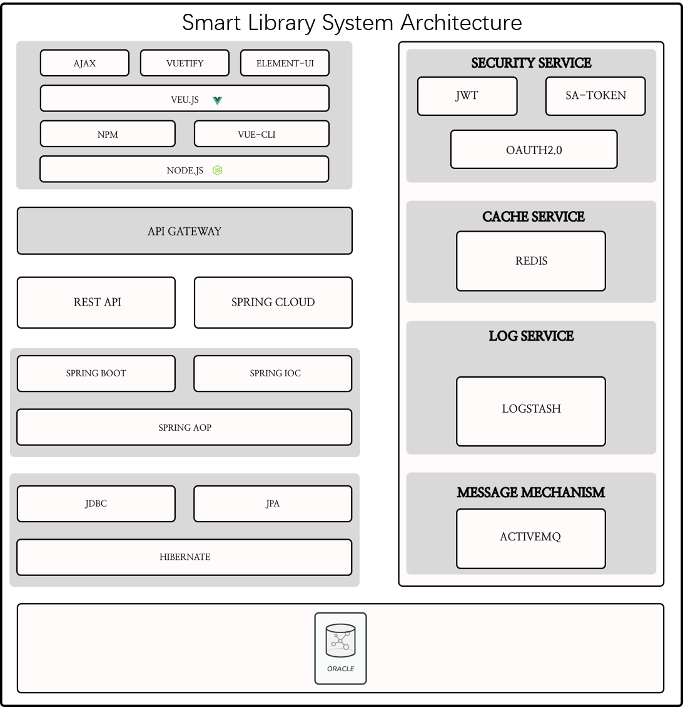

#### 3.2 Subsystems and interfaces

According to domain-driven design, in order to properly design thecorresponding domain services, we chose to divide the business boundaryinvolved in the system into four partial domains.

1.User Domain 

2.Reading RoomDomain

3.Book Domain

4.Online ForumDomain

Based on the above domain design, in order to accommodate the moderategranularity of services in the system design process, we choose to furtherdivide the microservices into the following systems based on functionality.

##### 3.2.1 Account Management System

| ORDER NUM | REST API                                                         | INTERFACE INTRODUCTION                                          |
| --------- | ---------------------------------------------------------------- | --------------------------------------------------------------- |
| 01        | GET /api/users/?userName=username & userPassword = userpassword/ | This interface is used to login the user account.               |
| 02        | POST /api/users/                                                 | This interface is used to register user accounts.               |
| 03        | DELETE /api/users/                                               | This interface is used to delete the user account.              |
| 04        | PUT /api/users/?userName=username/                               | This interface is used for users to modify account information. |

##### 3.2.2 Book Management System

| Order num | rest api                                               | interface introduction                                                 |
| --------- | ------------------------------------------------------ | ---------------------------------------------------------------------- |
| 05        | POST /api/users/suggestions                            | This interface is used to send suggestions from users to administrator |
| 06        | GET /api/users/suggestions                             | This interface is used to get suggestions                              |
| 07        | PUT /api/users/knowledgeGraph                          | This interface is used to update the knowledge graph                   |
| 08        | PUT /api/library/inventory?bookid=id&inventory=number/ | This interface is used to update the inventory of some books           |

##### 3.2.3 Book Borrowing System

| Order num | rest api             | interface introduction                                                                                                                                                                             |
| --------- | -------------------- | -------------------------------------------------------------------------------------------------------------------------------------------------------------------------------------------------- |
| 09        | GET/api/books/bookID | The interface accepts the bookID, returning the details of the specific book.                                                                                                                      |
| 10        | GET/api/users/userID | The interface accepts the userID and returns the details of the specific User.                                                                                                                     |
| 11        | PUT/api/books/bookID | The interface accepts requests from users to borrow, renew and return books for a specific purpose, and returns the operation after the modification of the specific book information is completed |
| 12        | PUT/api/users/userID | The interface accepts Librarian requests to modify the borrowing permission and modification penalty for a specific user and returns whether the operation is successful                           |

##### 3.2.4 Venue Management System

| Order num | rest api                               | interface introduction                                                                                                                                                         |
| --------- | -------------------------------------- | ------------------------------------------------------------------------------------------------------------------------------------------------------------------------------ |
| 13        | POST /api/venue/id                     | This interface accepts the id of a user, indicating the user has enter the venue, and return whether the operation is successful.                                              |
| 14        | GET /api/venue/authorization/id        | This interface returns one user's authorization of entering a certain venue.                                                                                                   |
| 15        | GET /api/venue/studyroom/info          | This interface returns the information like room numbers and timetable of study rooms.                                                                                         |
| 16        | POST /api/venue/studyroom/room_id      | This interface accepts the room number(id of a room) and if the room has vacancy, returns the timetable and the registration table of the room, else returns a denial message. |
| 17        | POST /api/venue/studyroom/time/room_id | This interface accepts a time period and change the room's registration table, and return whether the operation is successful.                                                 |
| 18        | POST /api/venue/studyroom/password     | This interface accepts the password of a study room, and return whether the operation is successful.                                                                           |

##### 3.2.5 Reader Communication System

| Order num | rest api                        | interface introduction                                               |
| --------- | ------------------------------- | -------------------------------------------------------------------- |
| 19        | GET /api/forum/post             | This interface is used to get all the posts in the forum             |
| 20        | POST /api/forum/post            | This interface is used to send a new post to the database            |
| 21        | POST /api/forum/post/id/reply   | This interface is used to add a new reply under a specific post      |
| 22        | DELETE /api/forum/post/id       | This interface is used to delete a specific post                     |
| 23        | DELETE /api/forum/post/id/reply | This interface is used to delete a specific reply to a specific post |

#### 3.3 Interface specification

##### 3.3.1 Basic Requirements:

To ensure the integrity and robustness of the system, thesystem interface shall meet the following basic requirements:

- The interface shall provide enterprise-level support for the access toexternal systems, and provide safe and reliable access on the basis of highconcurrency and large capacity of the system;

- Provide a perfect information security mechanism, to achieve thecomprehensive protection of information, ensure the normal operation of thesystem, should prevent a large number of access, and a large amount ofresources, to ensure the robustness of the system;

- Provide an effective system monitoring mechanism, so that the operation ofthe interface can be monitored, easy to timely detection and troubleshooting;

- Ensure that on the premise of making full use of the system resources,realize the smooth transplantation and expansion of the system, and provide thedynamic expansion of the system resources when the system increasesconcurrently, so as to ensure the stability of the system;

- In the expansion, new business expansion, should be able to provide fast,convenient and accurate implementation.

##### 3.3.2 Interface safety requirements:

In order to ensure the safe operation of the system, allkinds of interface modes should ensure the security of its access.

Interface security is an important part of the system security.Toensure the security of the interface, to realize the technical security controlthrough the interface, to achieve the security events "knowable,controllable, predictable", is an important basis to achieve systemsecurity.

According to the interface connection characteristics andbusiness characteristics, formulate a special security technologyimplementation strategy, to ensure the security of the interface datatransmission and data processing.

The system shall implement the interface security controlat the network boundary of the access point.

The security control of the interface logically includes:security assessment, access control, intrusion detection, passwordauthentication, security audit, anti-malicious code, encryption and other content.

##### 3.3.3 Transmission Control Requirements:

Transmission control uses high-speed data channeltechnology to distribute the large front-end data requests to the back end, soas to ensure that the application system can maintain a fast and stable workingstate when a large number of clients request services at the same time.

The system shall adopt transmission control means toreduce the burden of the interface network, improve the interface throughputcapacity, and ensure the overall processing capacity of the system.The specificmeans include load balancing, scalability and dynamic configuration management,network scheduling and other functions:

- Load balancing: In order to ensure the maximum throughput of interfaceservices, the interface shall automatically complete the dynamic load balancingscheduling in the system;

- Scalability and dynamic configuration management: by the system automaticscalability management mode or dynamic configuration management mode to achievequeue management, access resource management, and interface applicationsrecovery processing;

- Network scheduling: Set multiple network channels between the interfacesof the two sides to realize the multiple data channels and fault tolerance ofthe interface, ensure that when a network channel communication fails,automatically switch, and realize the automatic recovery of the interfaceconnection.

**The following example describes the interfacespecification between this system and the external system:**

Since the library management platform is involved bydifferent roles, in order to ensure the data privacy security and transmissionefficiency in the operation process, the project should include securityservices such as login and authentication.Considering that the front and backends of the project development process are separate and may be subject tounauthorized access and attacks during operation, the system has authenticationand other security requirements.So, we chose the lightweight and powerfulsecurity framework, sa-token to provide system security services.

Since there are many operation interfaces in thecommunity communication platform that are restricted after login, theinterfaces that need login permission operation need to be login authenticationbefore execution.sa-token provides an interface to query login status and tokeninformation parameters.This interface can be cut into other interfaces forcorresponding operations.

| StpUtil.setLoginId(Object loginId);           | Mark the account id of the current session login.                                                                      |
| --------------------------------------------- | ---------------------------------------------------------------------------------------------------------------------- |
| StpUtil.logout();                             | Log out of the current session.                                                                                        |
| StpUtil.isLogin();                            | Get whether the current session is logged in, return login state.                                                      |
| StpUtil.checkLogin();                         | Check whether the current session has been logged in, if not logged in, an exception will be thrown: NotLoginException |
| StpUtil.getLoginId();                         | Get the login id of the current session, if not logged in, an exception will be thrown: NotLoginException              |
| StpUtil.getLoginIdByToken(String tokenValue); | Get the login id corresponding to the specified token, if not logged in, return null                                   |
| StpUtil.getTokenValue();                      | Get the token value of the current session.                                                                            |
| StpUtil.getTokenInfo();                       | Get the token information parameters of the current session.                                                           |

In the login business logic, thecorrectness of the accountpassword.lf the account is legal, the interfaceStpUtil.ThesetLoginld (Object loginld) is called to mark that the user isloggedin.

#### 3.4 Example of interfaces

### 4. Design model

#### 4.1 Implemented use cases

##### 4.1.1 Users Login

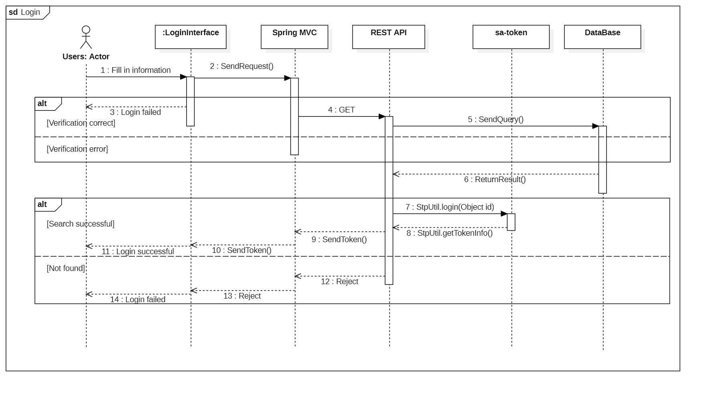

All users of the system need to log in when entering the system.

We use Spring MVC in the system to process login requests, and use the REST API to send information commands to the database that stores user account information, and use sa-token for account login authentication.

When the user enters the system, he first enters the account login interface of the system. After the user fills in his user name, password and verification code on this interface, he clicks the "Login" button. Login Interface first judges the correctness of the verification code. If the verification code is wrong, then Directly refuse to log in, login fails and prompts that the verification code is wrong; otherwise, if the verification code is correct, the information will be converted into JSON format and sent to Spring MVC, Spring MVC sends a query request to the database through the REST API. The database queries the tuple that matches the user name and password in the account information table and returns the query result. If it is not found, it means that the login information is incorrect, the login request is rejected, and the login fails. And it prompts that the user name or password is wrong; if it is correct, call StpUtil.login(id) to log in, and then get the login token information from sa-token through StpUtil.getTokenInfo(), send and save the token information to the front end, and the login is successful. This use case ends.

Some of the corresponding classes are represented in the class diagram below:

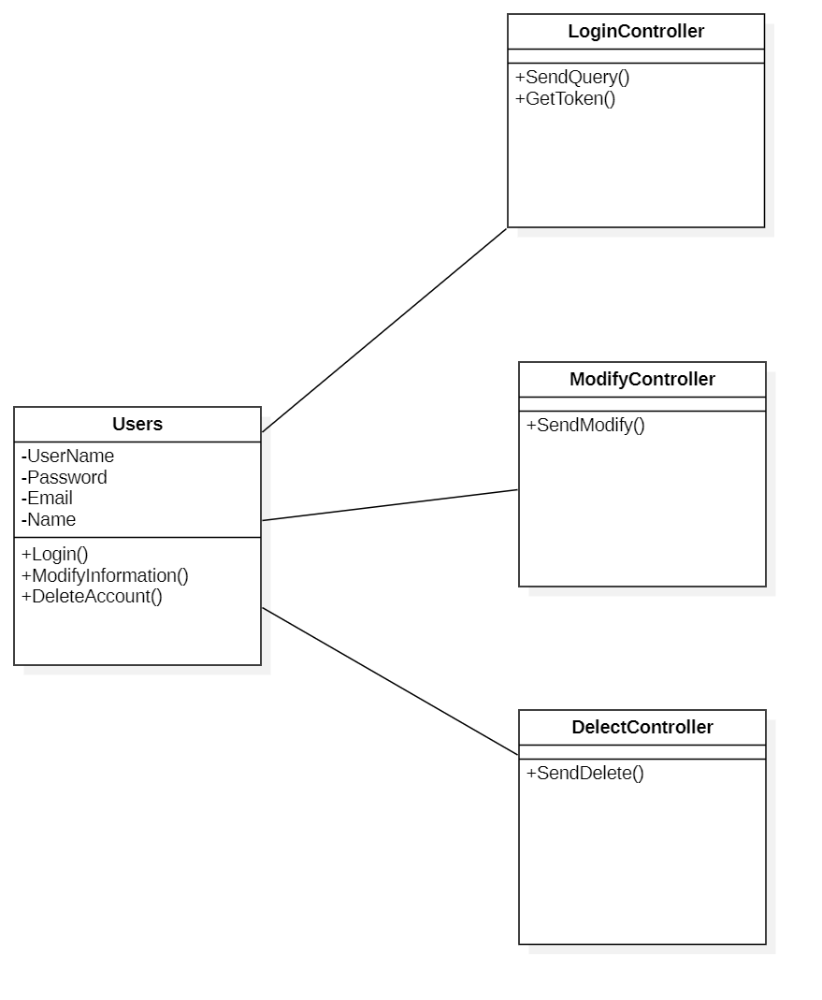

##### 4.1.2 Update Book Inventory

When the administrator enters the system, he can view the update suggestions submitted by the user, or directly update the book inventory, when updating the inventory, you need to choose one of the three to buy new books, increase, and decrease, after the selection, the front-end interface will package the data into a json file through AJAX and send it to the backend, and then call the relevant interface, access the database and update the information to achieve the request, and finally return the result to the front-end and display.

Some of the corresponding classes are represented in the class diagram below:

##### 4.1.3 Borrow Books

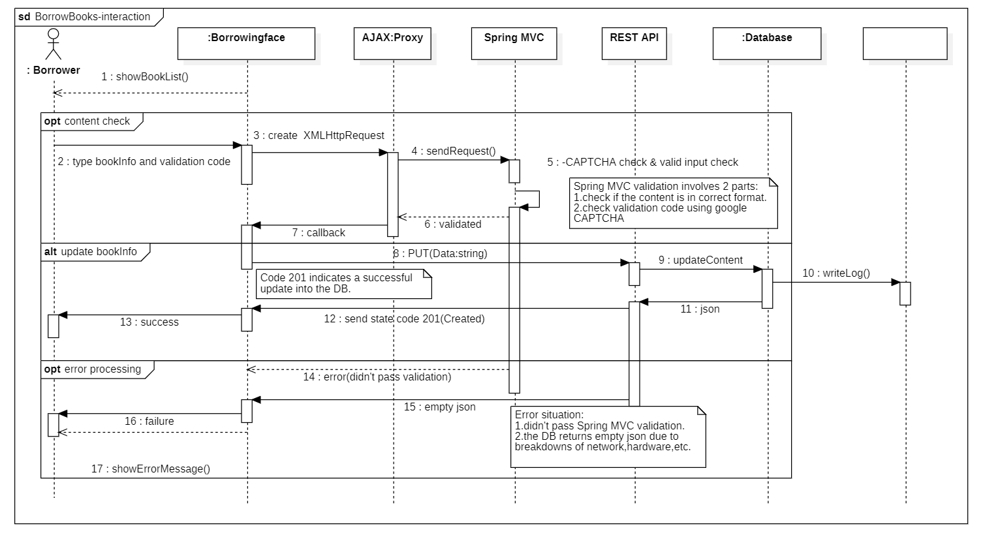

BorrowBooksis a use case. The procedure of the use case is demonstrated in the sequencediagram above.

Accordingto our system design, we used AJAX for data interaction. The Spring MVCframework will be used here to handle the request and the validation process. The approved contents will be submitted to the database through RESTAPI.

The user typesthe key information of the book he wants to borrow and a verification code forsecurity checks (for robot detection). After clicking the apply button, thecorresponding HTML form data is generated, and it is converted to a Java objectby AJAX technology. The corresponding request for the object is sent to theSpring MVC.

For theverification process, Spring MVC checks for the correctness of the contentformat. (The semantic level, not the content level) At the same time, we usethe external tool CAPTCHA([Maven Repository: com.github.penggle » kaptcha](https://mvnrepository.com/artifact/com.github.penggle/kaptcha)) developedby Google for the verification code to process the pending verification code toprevent the robot users. (Any content input with an illegal format or anincorrect verification code will be rejected)

After passingthe verification, the information of the books in the borrowing bookapplication to be submitted will be updated (the PUT command is supported byREST API) to the content database. The content-database will return the resultsin JSON format, indicating that the content has been successfully loaded intothe database. (If an operation is wrong, an empty JSON is returned and capturedby the error handling method)

Finally,the system refreshes the page and displays the updated library book listinformation.

Thecorresponding subsystems and interfaces and their communication modes are shownin the class diagram and communication diagram below:

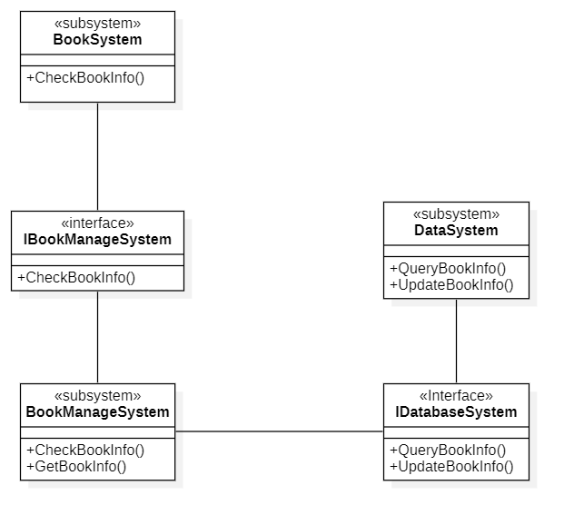

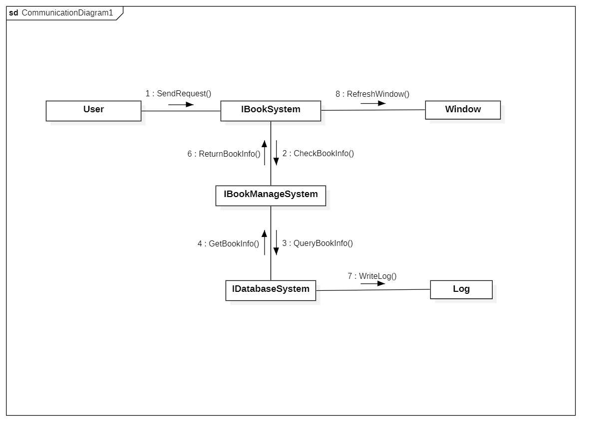

##### 4.1.4 Book a Study Room

Booking a study room is a crucial use case for users who wish to reserve a study room for a specific time period. The process of booking a study room is depicted in sequence diagram above.

Based on our system design, we employ AJAX for seamless data interaction. Additionally, we leverage the Spring MVC framework, as utilized in our previous use case realization, to handle requests and perform validation processes. The approved booking details will be submitted to the database through a REST API.

The user begins by browsing the available study rooms and their corresponding time periods. The system presents the information of all the available time slots for study rooms, allowing the user to view the room availability.

Once the user selects a vacant study room, they proceed to choose an available time slot for booking. This selection is made from the displayed options, indicating the time period during which the user intends to use the room.

Upon making the selection, the user confirms the booking information. This includes the chosen study room, the selected time period, and any other relevant details required for the booking process.

The system validates the user's booking request. Spring MVC is responsible for examining the correctness of the input format, ensuring it meets the required semantic level criteria. The pending validation code is utilized to verify the user's authenticity and deter robot users. Any booking input with an illegal format or an incorrect validation code will be rejected by the system.

After successful validation, the booking details are posted to the content database using the REST API's POST command. The database processes the request and returns the result in JSON format, indicating that the booking has been successfully stored in the database. In the event of an error during the operation, an empty JSON response will be returned and subsequently handled by error processing methods.

Finally, the system refreshes the webpage to display the study room booking with the newly added information. The user can now view their confirmed booking details, including the room number, chosen time period, and any other relevant information.

The corresponding subsystems and interfaces are represented in the class diagram provided below.

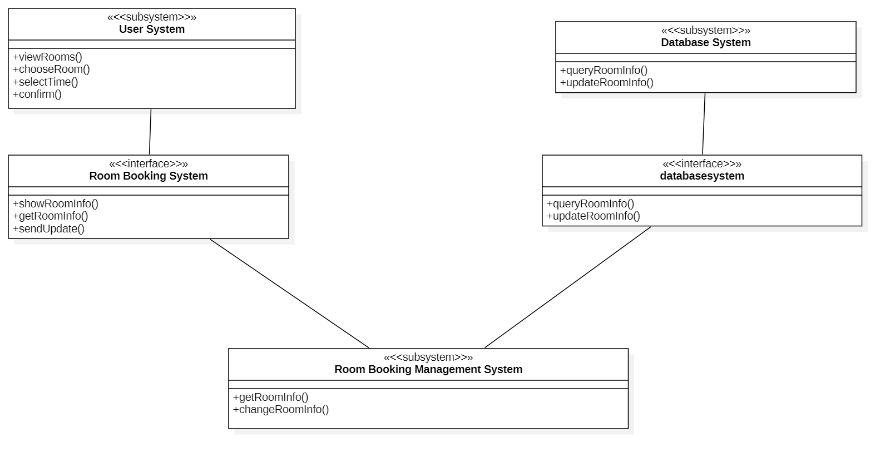

##### 4.1.5 Create Posts

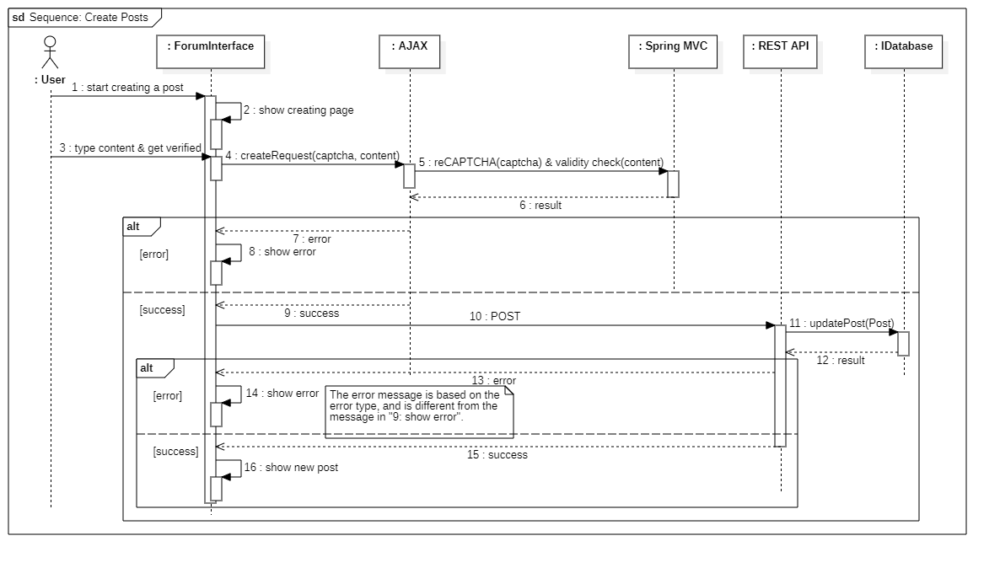

The use case "Create Posts" serves the purpose of generating new posts. The process for this use case is illustrated in the sequence diagram above.

We employ AJAX for data interaction in conjunction with the Spring MVC framework, which handles the validation process. Once the content is approved, it is submitted to the database via the REST API.

To initiate the post creation, the user activates the "Create a Post" button, prompting the system to transition to the post-creation page. Subsequently, the user inputs the desired post content along with a captcha for bot verification. Upon clicking the submit button, the relevant data is generated and transmitted to Spring MVC using AJAX techniques.

During the validation process, Spring MVC checks the content's format. Concurrently, we utilize Google reCAPTCHA (<https://mvnrepository.com/artifact/com.github.penggle/kaptcha>) to handle the captcha and prevent automated bot usage. Any content with an invalid format or an incorrect captcha will be rejected.

Upon successful validation, the post content is dispatched to the database interface via a POST command facilitated by the REST API. The interface inserts the data into the database and returns the corresponding result.

Finally, the system refreshes the webpage, displaying the newly created post if the operation was successful, or an error message if it failed.

Some of the corresponding classes are represented in the class diagram below:

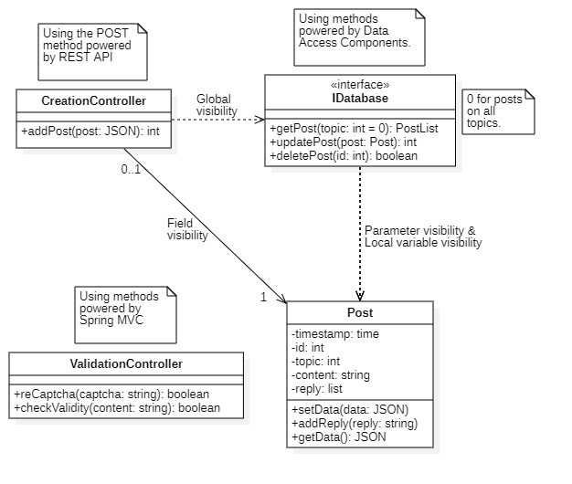

#### 4.2 Detailed class design

##### 4.2.3 Book Borrowing System

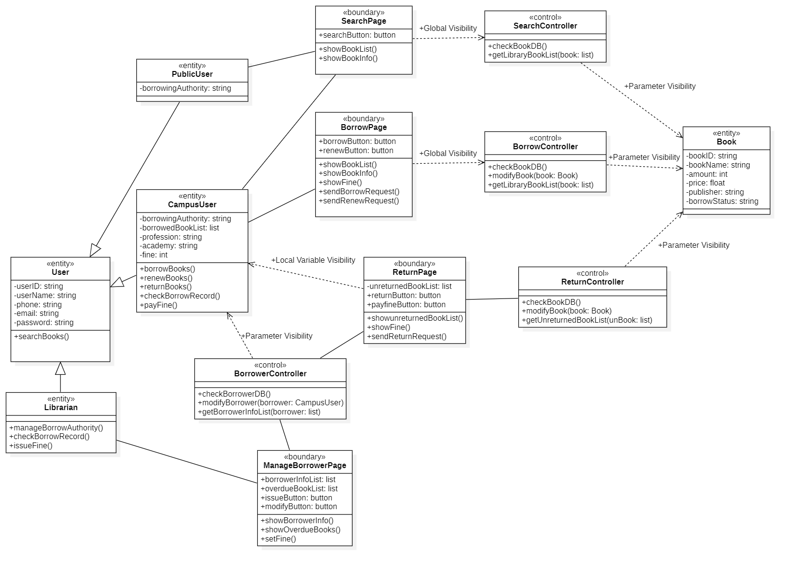

##### 4.2.4 Venue Management System

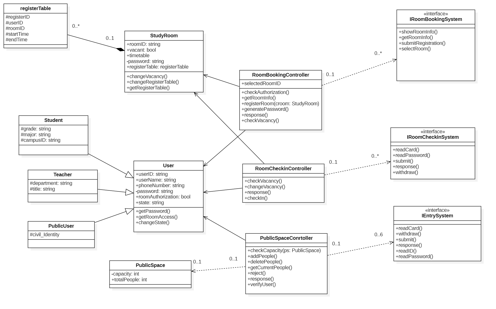

### 5. Architectural styles and critical design decisions

#### 5.1 Architectural styles

After analyzing the requirements of our intelligent library system, we believe that the system does not have high requirements for maintainability and expandability, because for a given library system, the number of users it can serve and the range of services it can provide are limited and will not continue to grow, and the functionality of the system will not change much, and there is no need to design additional interfaces for subsequent expansion; We focus more on the responsiveness and reliability of the system. From the user's point of view, users always want to keep their waiting time as short as possible, and no one wants the server to be down while they are receiving the service. Since the microservices architecture is more focused on the scalability and maintainability of the system, we chose the client-server architecture, which is more in line with our system requirements, as the main architecture.

`Client-Server Architecture`(CSA) is a common distributed computing architecture for building web applications and systems. In this architecture, the system is divided into two main components: the client and the server.

1. `Client`: The client is the front-end part of the system, usually a software application or user interface that runs on the user's device. The client is responsible for providing an interactive interface to the user, receiving user input and sending it to the server. It is also responsible for processing the data returned by the server and presenting the results to the user; it can be a desktop application, a mobile application, a Web browser, etc.
2. `Server`: The server is the back-end part of the system, responsible for processing requests sent by clients and providing corresponding services. The server usually runs on a dedicated hardware device or cloud server, which can handle requests from multiple clients and execute the corresponding business logic and data processing according to the type of requests, it can be an application server, database server, file server, etc.

The client and server communicate over the network, using standard communication protocols to transfer data. This front- and back-end separated architecture allows the client and server to be developed, deployed and maintained independently, improving the flexibility and scalability of the system. It also enables distributed computing, allowing the load to be distributed to multiple servers, improving system performance and scalability; it also supports cross-platform and cross-device access, enabling users to access and use the system through different devices and platforms.

Also, to make our system development, design, and maintenance easier, we have adopted a layered architecture model to aid in the design.

Our layered architecture diagram is as follows:

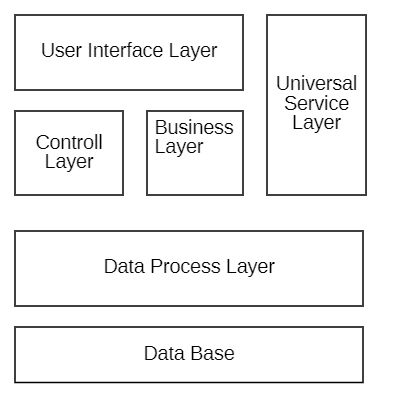

The detailed logic layer is implemented as follows: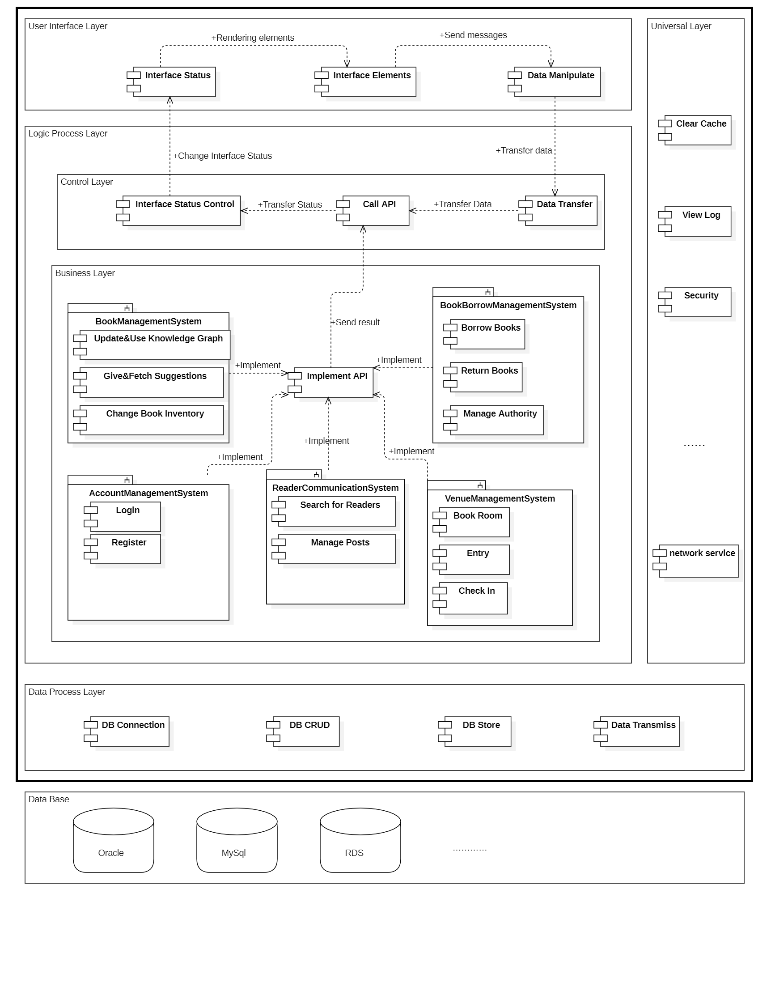

In this layered architecture, each layer is built on top of its next layer and provides a set of clearly defined interfaces and functions. The Application Layer accepts requests from the Presentation Layer and calls the core methods of the Domain Layer to process various requests, while the Domain Layer has direct access to the bottom Data Access Layer, which effectively protects the data from being exposed to other layers.

#### 5.2 Design pattern

In our various subsystems, we use the following design patterns:

1. `Singleton Pattern`: For all users, the same intelligent library system is shared, so it is necessary to ensure that only one library use case exists. This can be achieved by defining a static variable of type `static` in the class, and when it is time to shut down the system, the instance can be saved by a serialization operation to allow the next time the system is started to work again from where it ended last time.
2. `Factory Pattern`: As it is necessary to use different pictures to fill different labels when displaying the interface, in order to avoid using specific class instantiation operations in the client code, we encapsulate the instantiated picture class as a picture factory, and different picture classes can implement the interface in different ways.
3. `Observer Pattern`: The data in the interface is updated in real time, and also displays different data according to the user's operation. We need to add monitoring (observer) for each component (observed) that may be updated to ensure that the data is true. Each observer only needs to pay attention to its own bound observer and does not need to care about the state changes of other components, which can achieve loose coupling between objects and further enhance the maintainability and flexibility of the system.
4. `MVC pattern`: Its basic idea is to achieve loose coupling and maintainability of the code by separating different aspects of the application. The model is responsible for handling data and business logic, the view is responsible for presenting data, and the controller is responsible for coordinating user input and model operations. It provides a clear code structure, making the code easy to understand and maintain; it achieves modularity and reusability, allowing the model, view and controller to be modified and extended independently; it also supports multiple views for the same model, providing flexible user interface customization capabilities.

#### 5.2 Critical design decisions

In order to ensure the ease of use of the system and enable users to easily and quickly grasp the usage of the system, we have designed a simple and natural execution path for each use case in the system, and users can implement it in the system through simple steps that they are familiar with various functions.

In order to ensure a good user experience and high code maintainability, our system adopts the development method of front-end and back-end separation.

In order to ensure security, the system uses an authority authentication framework. Since the system only provides services for students and teachers of one school and some off-campus users, the scope of use is not large, so a simple and lightweight authority authentication framework sa-token was chosen.

In order to ensure high security and stability of the system, we chose the Oracle database as the database used in the system. Another reason for this choice is that our team members are also familiar with the Oracle database.

### 6. Contributions
