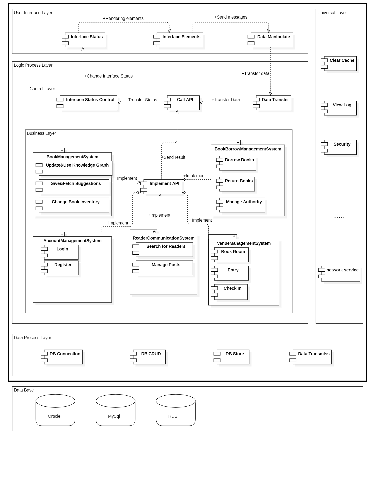

### 1、Introduction and overview

<u>The introduction file should describe the UML models and other artifacts created for your system analysis and design. The file should concisely indicate changes and additions, if any, of your project’s specification and design.</u>

### 2、Updated use case model

更新的内容

### 3、 Architecture Refinement

#### 3.1 Platform-dependent architecture

#### 3.2 Subsystems and interfaces

写自己类的接口 2.2

#### 3.3 Interface specification

#### 3.4 Example of interfaces

### 4、Design model

#### 4.1 Implemented use cases

画系统的功能实现 4

#### 4.2 Detailed class design

画类图的详细设计

### 5、Architectural styles and critical design decisions

#### 5.1 Architectural styles 

After analyzing the requirements of our intelligent library system, we believe that the system does not have high requirements for maintainability and expandability, because for a given library system, the number of users it can serve and the range of services it can provide are limited and will not continue to grow, and the functionality of the system will not change much, and there is no need to design additional interfaces for subsequent expansion; We focus more on the responsiveness and reliability of the system. From the user's point of view, users always want to keep their waiting time as short as possible, and no one wants the server to be down while they are receiving the service. Since the microservices architecture is more focused on the scalability and maintainability of the system, we chose the client-server architecture, which is more in line with our system requirements, as the main architecture.

`Client-Server Architecture `(CSA) is a common distributed computing architecture for building web applications and systems. In this architecture, the system is divided into two main components: the client and the server.

1. `Client`: The client is the front-end part of the system, usually a software application or user interface that runs on the user's device. The client is responsible for providing an interactive interface to the user, receiving user input and sending it to the server. It is also responsible for processing the data returned by the server and presenting the results to the user; it can be a desktop application, a mobile application, a Web browser, etc.
2. `Server`: The server is the back-end part of the system, responsible for processing requests sent by clients and providing corresponding services. The server usually runs on a dedicated hardware device or cloud server, which can handle requests from multiple clients and execute the corresponding business logic and data processing according to the type of requests, it can be an application server, database server, file server, etc.

The client and server communicate over the network, using standard communication protocols to transfer data. This front- and back-end separated architecture allows the client and server to be developed, deployed and maintained independently, improving the flexibility and scalability of the system. It also enables distributed computing, allowing the load to be distributed to multiple servers, improving system performance and scalability; it also supports cross-platform and cross-device access, enabling users to access and use the system through different devices and platforms.

Also, to make our system development, design, and maintenance easier, we have adopted a layered architecture model to aid in the design.

Our layered architecture diagram is as follows:

The detailed logic layer is implemented as follows:

In this layered architecture, each layer is built on top of its next layer and provides a set of clearly defined interfaces and functions. The Application Layer accepts requests from the Presentation Layer and calls the core methods of the Domain Layer to process various requests, while the Domain Layer has direct access to the bottom Data Access Layer, which effectively protects the data from being exposed to other layers.

#### 5.2 Design pattern

In our various subsystems, we use the following design patterns:

1. `Singleton Pattern`: For all users, the same intelligent library system is shared, so it is necessary to ensure that only one library use case exists. This can be achieved by defining a static variable of type `static` in the class, and when it is time to shut down the system, the instance can be saved by a serialization operation to allow the next time the system is started to work again from where it ended last time.
2. `Factory Pattern`: As it is necessary to use different pictures to fill different labels when displaying the interface, in order to avoid using specific class instantiation operations in the client code, we encapsulate the instantiated picture class as a picture factory, and different picture classes can implement the interface in different ways.
3. `Observer Pattern`: The data in the interface is updated in real time, and also displays different data according to the user's operation. We need to add monitoring (observer) for each component (observed) that may be updated to ensure that the data is true. Each observer only needs to pay attention to its own bound observer and does not need to care about the state changes of other components, which can achieve loose coupling between objects and further enhance the maintainability and flexibility of the system.
4. `MVC pattern`: Its basic idea is to achieve loose coupling and maintainability of the code by separating different aspects of the application. The model is responsible for handling data and business logic, the view is responsible for presenting data, and the controller is responsible for coordinating user input and model operations. It provides a clear code structure, making the code easy to understand and maintain; it achieves modularity and reusability, allowing the model, view and controller to be modified and extended independently; it also supports multiple views for the same model, providing flexible user interface customization capabilities.

#### 5.2 Critical design decisions

### 6、Contributions