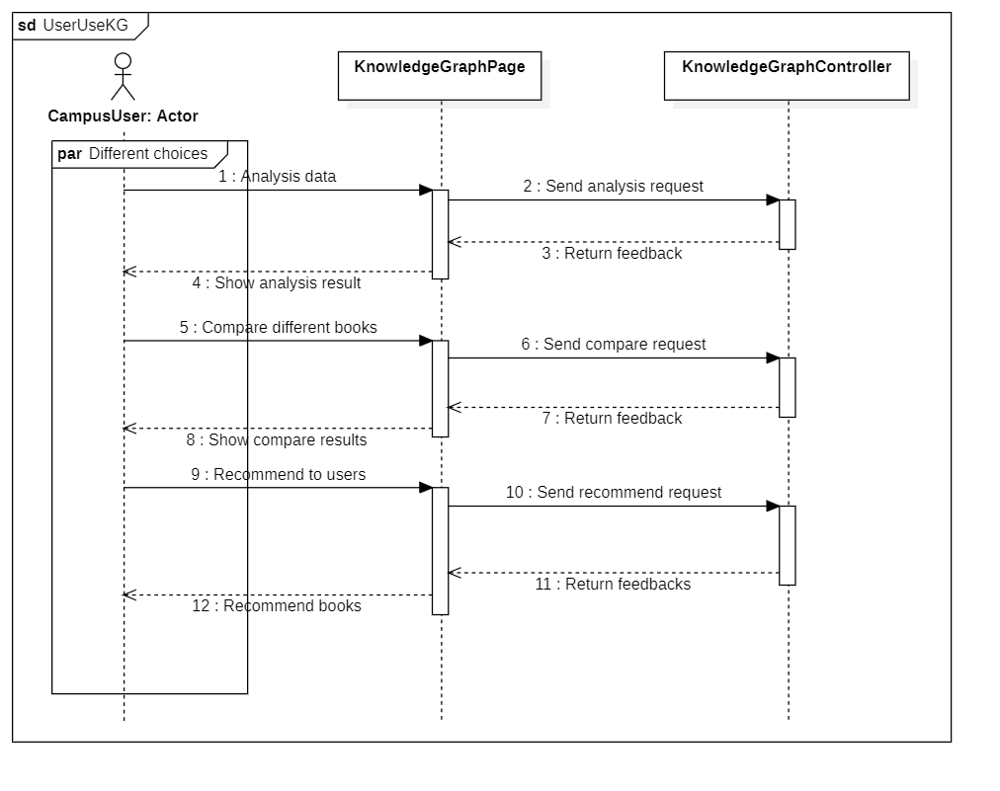

简短的描述这次项目的目标（500）

精确的描述从上次以来的进展，指出变化的地方，重定义的内容和现在的状态

架构分析：以高级架构、子系统的形式介绍项目，并详细说明在当前阶段之前所做的体系结构决策。您应该至少包括一个系统级图表，例如，系统的分层体系结构。您还应该为系统级关系图提供文本描述。

描述类图和时序图

更新用例模型，说明为什么更改

注释参考文献：描述项目参考文献（例如，项目领域书籍和两篇参考文章）与您的项目的关系。参考文献的描述应该在200到300个单词之间。

描述每个属性的含义

### Process and current status

In the first document, we have already provided readers with a detailed description of the
functionalities of JIYU( Meet What You Will Meet ), and this document covers the
progress of analysis model and architectural analysis.
In this System Analysis Document, we have presented the project in terms of high-level
architecture, detailed architectural decisions until current stage. We create the layer
architecture diagram of the system and built the package diagram to illustrate the
components of each layer.
To make system more reliable and easier to be developed, the document present analysis
model which includes sequence diagram and class diagram. For sequence diagram, the
developers can get to know how the system works in every use cases. As for class
diagrams, it presents relationship between entity classes, boundary classes and control
classes.
Besides, we also update our system during analysis. A new subsystem is added to make
the system more completed, which will be introduced in next subsection. And the
snapshots of system are also changed to be more user-friendly and function-completed

在第一份文件中，我们已经向读者提供了关于JIYU(Meet What You Will Meet)功能的详细描述，而这份文件涵盖了分析模型和架构分析的进展。在这份系统分析文件中，我们从高层架构的角度介绍了项目，详细的架构决策直到当前阶段。我们创建了系统的层架构图，并建立了包图来说明每一层的组件。为了使系统更可靠，更容易开发，该文件提出了分析模型，包括顺序图和类图。对于序列图，开发人员可以了解系统在每个用例中是如何工作的。至于类图，它展示了实体类、边界类和控制类之间的关系。此外，我们还在分析过程中更新我们的系统。一个新的子系统被添加进来，以使系统更加完善，这将在下一小节介绍。而且 系统的快照也进行了修改，以使其更加方便用户，功能更加完备。

### Changes in use case models

#### BookManagementSystem

In the last assignment , in terms of the knowledge graph, I only considered the librarian's modifications to it. For this assignment , I found that users also have the need to use the knowledge graph, so I added the function to use the knowledge graph to the use case model

The updated use case diagram is as follows .

### Description of class diagram and sequence diagram

#### BookManagementSystem

##### Class diagram

##### Sequence diagram

###### 1.User give suggestions

This sequence diagram shows what happens after a user submits a suggestion. The page sends the suggestion as a request to the backend, which receives it, returns a success message, and gives feedback in the user interface.

###### 2.Librarian get suggestions

The process of administrator viewing suggestions is similar to the process of user sending suggestions, except that the request sent by the interface changes from a suggestion to a get request, and the data returned by the backend changes from success information to the content of the suggestion

###### 3.Manage inventory

This sequence diagram shows the process by which a librarian receives a suggestion and then changes the book inventory based on the suggestion. The librarian first selects one from adding books and reducing books (adding books includes adding existing books and acquiring new books). If adding books is selected, the books are added and the newly added books are classified, tagged, indexed, etc., and then the information of the book inventory is updated; if reducing books is selected, the books are directly reduced and the book information is updated.

###### 4.Librarian change knowledge graph

This sequence diagram shows the various operations of the librarian on the knowledge graph. The librarian can delete, add, or update the knowledge graph, and all three processes are similar: the interface first sends a request to the backend, which receives the request and processes it logically, then returns the result to the interface and displays it.

###### 5.User use knowledge graph

The process of using knowledge graphs by users is similar to that of librarians. Users can choose to view the current knowledge graph, use the knowledge graph to compare different books, analyze users' reading preferences based on their reading records and get recommended books, and other operations. All these operations are the process that the page initiates the request, the back-end processes it and returns the result and displays it.

